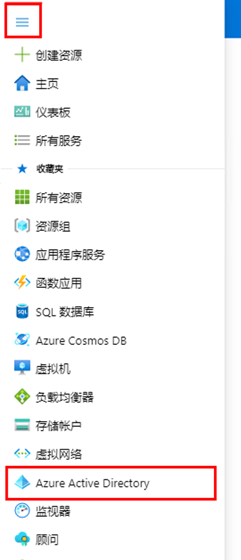
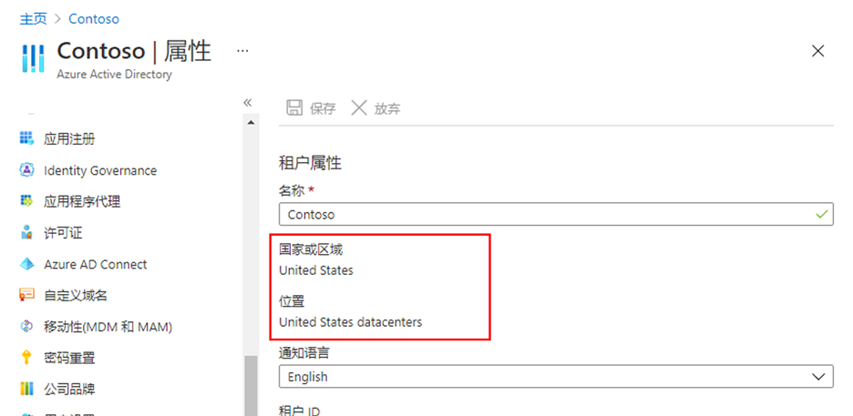
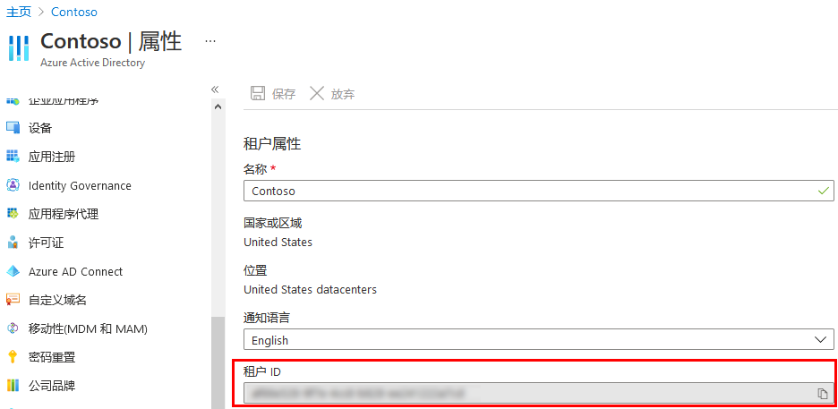
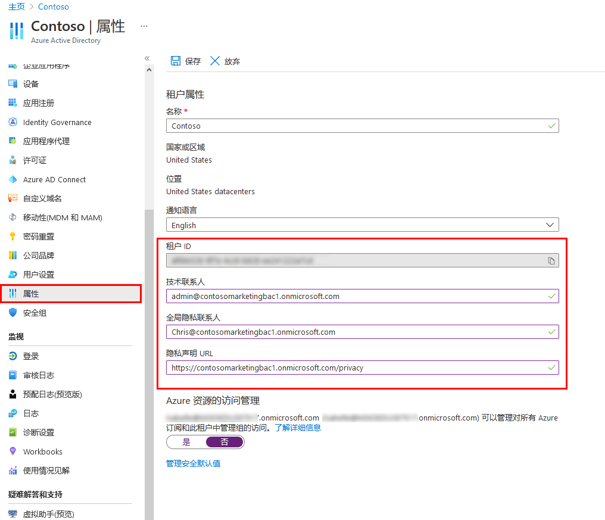
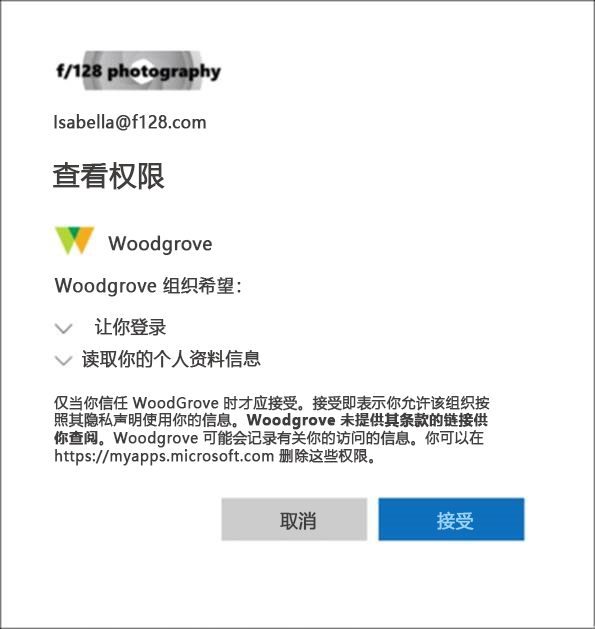

---
lab:
    title: '02 - 使用租户属性'
    learning path: '01'
    module: '模块 01 - 实现标识管理解决方案'
---

# 实验室 02：使用租户属性

## 实验室场景

你需要标识和更新与你的租户关联的不同属性。

#### 预计用时：10 分钟

## 练习 1 - 更改租户显示名称

### 任务 1 - 设置租户名称和技术联系人

1. 浏览到 [https://portal.azure.com](https://portal.azure.com)，使用目录的全局管理员帐户登录。

2. 选择“**显示门户菜单**”汉堡图标，然后选择“**Azure Active Directory**”。

    

3. 在左侧导航栏的“管理”部分中，选择“**属性**”。

4. 在对话框中更改“**姓名**”和“**技术联系人**”的租户属性。

| **设置** | **值** |
| :--- | :--- |
| 名称 | Contoso 市场营销 |
| 技术联系人 | `your Global admin account` |

5. 选择“**保存**”以更新租户属性。

      ##### 保存完成后，你会立即发现名称已更改。

## 任务 2 - 查看国家或地区以及与租户相关的其他值

1. 在“**Azure Active Directory**”边栏选项卡的“管理”部分，选择“**属性**”。

2. 在“**租户属性**”下，找到“**国家或地区**”，查看相关信息。

    **重要提示** - 创建租户时将指定国家或地区。稍后将无法更改此设置。

3. 在“**属性**”边栏选项卡的“**租户属性**”下，找到“**位置**”并查看相关信息。

    

## 任务 3 - 查找租户 ID

Azure 订阅与 Azure Active Directory (Azure AD) 建立了信任关系。Azure AD 是用于对订阅的用户、服务和设备进行身份验证的受信任服务。每个订阅都有一个与其关联的租户 ID，你可通过多种方式来查找订阅的租户 ID。

1. 在“**Azure Active Directory**”边栏选项卡的“管理”部分，选择“**属性**”。

2. 在“**租户属性**”下，找到“**租户 ID**”。这是你的唯一租户标识符。

    

## 练习 2 - 设置隐私信息

### 任务 1 - 在 Azure AD 上添加隐私信息，包括全局隐私联系人和隐私声明 URL

Microsoft 强烈建议添加全局隐私联系人和组织的隐私声明，以便内部员工和外部来宾可以查看你的策略。由于隐私声明专为每个企业创建和定制，因此强烈建议你与律师联系以获取帮助。

   **备注** - 有关查看或删除个人数据的信息，请参阅 [https://docs.microsoft.com/microsoft-365/compliance/gdpr-dsr-azure](https://docs.microsoft.com/microsoft-365/compliance/gdpr-dsr-azure)。如需详细了解 GDPR，请参阅 [https://servicetrust.microsoft.com/ViewPage/GDPRGetStarted](https://servicetrust.microsoft.com/ViewPage/GDPRGetStarted)。

可以在 Azure AD 的“**属性**”区域中添加组织的隐私信息。访问“属性”区域并添加隐私信息：

1. 在“**Azure Active Directory**”边栏选项卡的“管理”部分，选择“**属性**”。

    

1. 为员工添加隐私信息：

- **全局隐私联系人** - `AllanD@` **你的 Azure 实验室域名**
     - Allan Deyoung 是 Azure 实验室租户中的内置用户，担任 IT 管理员，我们将其作为隐私联系人。
     - 此人同时也是 Microsoft 联系人，可在出现数据泄露时联系此人。如果此处未列出任何人，Microsoft 将联系全局管理员。

- **隐私声明 URL** -  `https://github.com/R-C-Stewart/SC-300-Identity-and-Access-Administrator/blob/master/Allfiles/Labs/Lab2/SC-300-Lab_ContosoPrivacySample.pdf`
     - 实验室目录中提供了示例隐私 PDF 文件。
     - 键入指向组织文档的链接，该文档描述组织如何处理内部和外部来宾的数据隐私。

    **重要提示** - 如果不加入自己的隐私声明或隐私联系人，外部来宾将在“查看权限”框中看到以下内容： **<你的组织名称\>** 未提供条款链接供你查看。例如，来宾用户将在收到通过 B2B 协作访问组织的邀请时看到此消息。

    

1. 选择“**保存**”。

### 任务 2 - 检查隐私声明

1. 返回 Azure 主屏幕 - 仪表板。
2. 在 UI 的右上角，单击你的用户名。
3. 从下拉菜单中选择“**查看帐户**”。

     ##### 此时会自动打开一个新的浏览器选项卡。

4. 在“**设置和隐私**”卡中选择“**查看设置和隐私 >**”。
5. 选择“**隐私**”。
6. 用户“**组织的通知**”，单击 Contoso 市场营销组织隐私声明旁边的“**查看**”项。

     ##### 此时将打开一个新的浏览器选项卡，其中显示链接指向的隐私 PDF 文件。

7. 查看示例隐私声明。
8. 关闭其中包含 PDF 文件的浏览器选项卡。
9. 关闭显示“**我的帐户**”项的浏览器选项卡。
