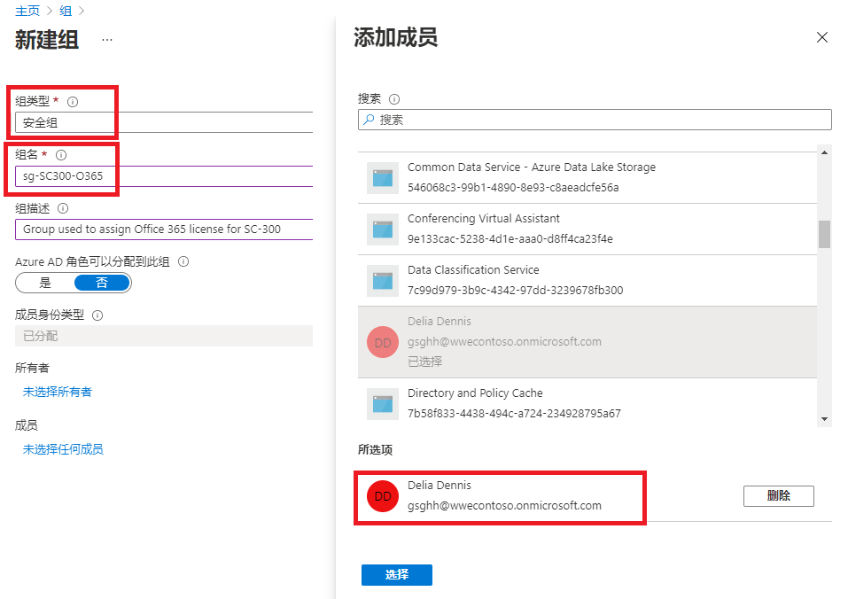
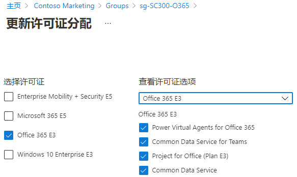
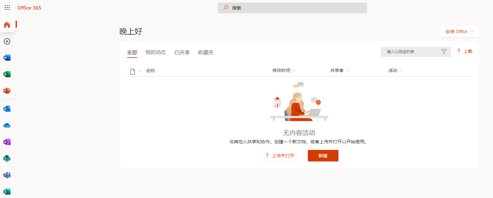

---
lab:
    title: '03 - 使用组成员身份分配许可证'
    learning path: '01'
    module: '模块 02 - 创建、配置和管理标识'
---

# 实验室 03：使用组成员身份分配许可证

## 实验室场景

你的公司决定使用 Azure AD 中的安全组来管理许可证。你需要配置新的安全组，向该组分配许可证，以及验证组成员许可证是否已更新。

#### 预计用时：10 分钟

## 练习 1 - 创建安全组并添加用户

### 任务 1 - 检查 Delia Dennis 是否可以访问 Office 365

1. 启动浏览器窗口。
2. 连接到 [https://www.office.com](https://www.office.com)。
3. 单击“登录”并以 Delia Dennis 的身份进行连接。

    | **设置**| **值**|
    | :--- | :--- |
    | 用户名 | DeliaD@ <<you azure domain>>|
    | 密码| pass@word123|

4. 你应会连接到 Office.com 网站，但会看到一条消息，该消息表示你没有许可证。

    
    
5. 关闭浏览器窗口。

### 任务 2 - 在 Azure Active Directory 中创建安全组

1. 浏览到 [https://portal.azure.com/#blade/Microsoft_AAD_IAM/ActiveDirectoryMenuBlade/Overview]( https://portal.azure.com/#blade/Microsoft_AAD_IAM/ActiveDirectoryMenuBlade/Overview)。

2. 在左侧导航栏的“**管理**”下，选择“**组**”。
3. 在“组”边栏选项卡的菜单中，选择“**新建组**”。
4. 使用以下信息创建组：

    | **设置**| **值**|
    | :--- | :--- |
    | 组类型| 安全性|
    | 组名| sg-SC300-O365|
    | `成员身份类型| 已分配|
    | 所有者| *分配自己的管理员帐户作为组所有者*|

5. 单击“成员”下的“**未选定成员**”文本。
6. 从用户列表中选择“**Delia Dennis**”。
7. 单击“**选择**”按钮。

    

8. 单击“**创建**”按钮。
9. 完成后，验证名为“**sg-SC300-O365**”的组是否显示在“**所有组**”列表中。

## 任务 3 - 向组分配许可证

1. 在“**所有组**”列表中，选择“**sg-SC300-O365**”。
2. 在“市场营销”边栏选项卡的“**管理**”下，选择“**许可证**”。
3. 在菜单中选择“**+ 分配**”。
4. 在“更新许可证分配”边栏选项卡的“**选择许可证**”下，查看可用许可证列表，然后选中“**Office 365 E3**”复选框。

    **提示** - 选择多个许可证后，可使用“查看许可证选项”菜单来选择特定许可证，并查看该许可证的许可证选项。

    

6. 选择“**保存**”。

### 任务 4 - 确认 Office 365 许可证

1. 启动浏览器窗口。
2. 连接到 [https://www.office.com](https://www.office.com)。
3. 单击“登录”并以 Delia Dennis 的身份进行连接。

    | **设置**| **值**|
    | :--- | :--- |
    | 用户名 | DeliaD@ <<you azure domain>>|
    | 密码| pass@word123|

4. 你应连接到 Office.com 网站，然后未看见关于许可证的消息。所有的 Office 应用程序都可在左侧获取。

    
    
5. 关闭浏览器窗口。
    
