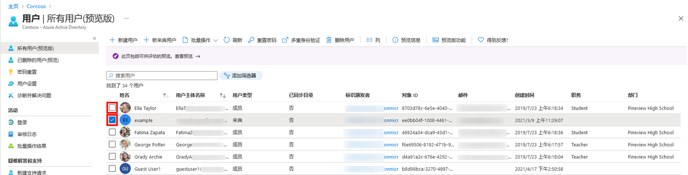

---
lab:
    title: '04 - 还原已删除的用户'
    learning path: '01'
    module: '模块 02 - 创建、配置和管理标识'
---

# 实验室 04：还原已删除的用户

## 实验室场景

可能出现已删除帐户，然后需要恢复此帐户的情况。你需要验证是否可以恢复最近已删除的帐户。

#### 预计用时：5 分钟

## 从 Azure Active Directory 删除用户

1. 浏览到 [https://portal.azure.com/#blade/Microsoft_AAD_IAM/ActiveDirectoryMenuBlade/Overview]( https://portal.azure.com/#blade/Microsoft_AAD_IAM/ActiveDirectoryMenuBlade/Overview).

1. 在左侧导航栏的 **“管理”** 下，选择 **“用户”**。

1. 在 **“用户”** 列表中，选中要删除的用户对应的复选框。例如，选择 **“Chris Green”**。

    >[!提示]
    >通过从列表中选择用户可以同时管理多个用户。如果选择某个用户，打开该用户的边栏选项卡后，你将只能管理这一个用户。

    

1. 选中用户帐户后，在菜单上选择 **“删除用户”**。

1. 查看对话框，然后选择 **“确定”**。

## 还原已删除的用户

1. 在“用户”边栏选项卡的左侧导航栏中，选择 **“已删除的用户”**。

1. 查看已删除用户的列表，并选择刚删除的用户。

    >[!重要说明]
    >默认情况下，已删除的用户帐户会在 30 天后自动从 Azure Active Directory 中永久移除。

1. 在菜单上，选择 **“还原用户”**。

1. 查看对话框，然后选择 **“确定”**。

1. 在左侧导航栏中，选择 **“所有用户”**。

1. 验证用户是否已还原。
