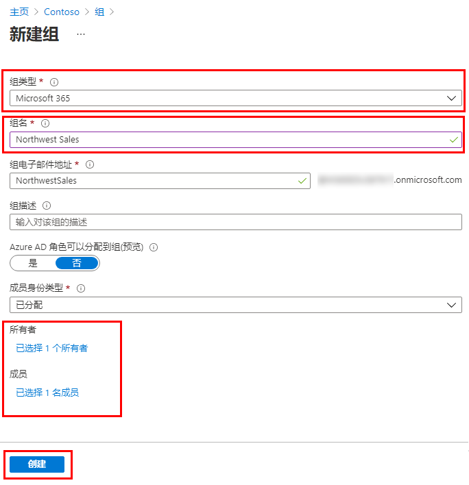

---
lab:
    title: '05 - 向 Azure AD 添加组'
    learning path: '01'
    module: '模块 02 - 创建、配置和管理标识'
---

# 实验室 05：向 Azure AD 添加组

## 实验室场景

你作为 Azure AD 管理员的职责之一是创建不同类型的组。你需要为组织的销售部门创建新的 Microsoft 365 组。

#### 预计用时：5 分钟

## 在 Azure Active Directory 中创建 Microsoft 365 组

1. 浏览到 [https://portal.azure.com/#blade/Microsoft_AAD_IAM/ActiveDirectoryMenuBlade/Overview]( https://portal.azure.com/#blade/Microsoft_AAD_IAM/ActiveDirectoryMenuBlade/Overview)。

1. 在左侧导航栏的“**管理**”下，选择“**组**”。

1. 在“组”边栏选项卡的菜单中，选择“**新建组**”。

1. 使用以下信息创建组：

    | **设置**| **值**|
    | :--- | :--- |
    | 组类型| Microsoft 365|
    | 组名| 西北部销售额|
    | 成员身份类型| 已分配|
    | 所有者| *分配自己的管理员帐户作为组所有者*|
    | 成员| **Alex Wilber** 和 **Bianca Pisani**|

    

1. 完成后，验证名为“**西北部销售额**”的组是否显示在“**所有组**”列表中。
