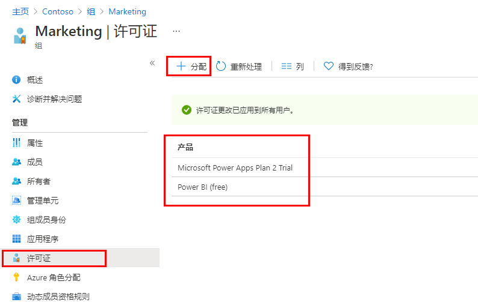

---
lab:
    title: '06 - 更改组许可证分配'
    learning path: '01'
    module: '模块 02 - 创建、配置和管理标识'
---

# 实验室 06：更改组许可证分配

## 实验室场景

你有时可能需要更改 Azure AD 安全组使用的许可证分配。你需要确保熟悉更改组的许可证分配的流程。

#### 预计用时：5 分钟

## 更改组许可证分配

1. 浏览到 [https://portal.azure.com/#blade/Microsoft_AAD_IAM/ActiveDirectoryMenuBlade/Overview]( https://portal.azure.com/#blade/Microsoft_AAD_IAM/ActiveDirectoryMenuBlade/Overview)。

1. 在左侧导航栏的“**管理**”下，选择“**组**”。

1. 选择一个可用组。例如“市场营销”。

1. 在左侧导航栏的“**管理**”下，选择“**许可证**”。

1. 查看当前分配，然后在菜单上选择“**+ 分配**”。

    

1. 在“更新许可证分配”边栏选项卡上，单独或组合使用以下操作：选择“**Windows 10 企业版 E3**”许可证、取消选择现有许可证、添加或删除许可证选项。

1. 完成后选择“**保存**”。

1. 在组的“许可证”页上，查看所做的更改。
