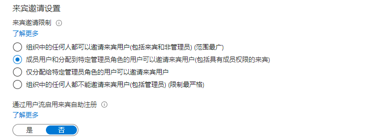

---
lab:
    title: '08 - 配置外部协作设置'
    learning path: '01'
    module: '模块 03 - 实现和管理外部标识'
---

# 实验室 08：配置外部协作设置

## 实验室场景

你需要为组织启用外部协作设置以进行批准的来宾访问。

#### 预计用时：5 分钟

## 练习 1 - 允许邀请来宾用户加入组织

### 任务 1：配置外部协作设置

1. 以租户管理员身份登录到 [https://portal.azure.com](https://portal.azure.com)。
2. 选择“**Azure Active Directory**”。
3. 选择“**外部标识 > 外部协作设置**”。
4. 单击屏幕顶部附近的“**电子邮件一次性密码**”通知链接。

    **备注** - 一次性密码是一种非常安全的方式，可用于邀请用户加入组织。

5. 单击 `Home > Contoso Marketing >` “**外部标识**”以返回上一屏幕。
6. 单击左侧的“**外部协作设置**”

7. 在“**来宾用户访问权限**”下，查看可用的访问级别，然后选择“**来宾用户访问权限仅限于他们自己的目录对象的属性和成员身份(限制最严格)**”。

    **备注**

    - 来宾用户与成员具有相同的访问权限（限制性最低）：此选项为来宾提供与成员用户相同的对 Azure AD 资源和目录数据的访问权限。
    - 来宾用户对目录对象的属性和成员身份具有有限的访问权限：（默认）此设置可阻止来宾执行某些目录任务，如枚举用户、组或其他目录资源。来宾可以看到所有非隐藏组的成员身份。
    - 来宾用户访问仅限于其自己的目录对象的属性和成员身份（限制性最高）：使用此设置，来宾只能访问自己的个人资料。来宾不能看到其他用户的个人资料、组或组成员身份。

    

8. 在“**来宾邀请**”设置下，选择“**成员用户和分配有特定管理员角色的用户可以邀请来宾用户，包括具有成员权限的来宾!**”

    **备注**
    
    - 管理员和具有“来宾邀请者”角色的用户可以邀请：若要允许管理员和具有“来宾邀请者”角色的用户邀请来宾，请将此策略设置为“是”。
    - 成员可邀请：若要允许目录的非管理员成员邀请来宾，请将此策略设置为“是”。
    - 来宾可邀请：若要允许来宾邀请其他来宾，请将此策略设置为“是”。
    - 通过用户流启用来宾自助注册：通过与目录中的应用程序关联的用户流来启用或禁用来宾自助注册。禁用时，需要将来宾邀请到目录。
    - 如果将“成员可以邀请”设置为“否”，并且将“管理员和具有“来宾邀请者”角色的用户可以邀请”设置为“是”，则具有来宾邀请者角色的用户仍可邀请来宾。

    

9. 在“**协作限制**”下，查看可用选项并接受默认设置。

    **重要提示**
    
    - 可以创建允许列表或拒绝列表。不能同时设置这两种类型的列表。默认情况下，不在允许列表中的任何域都会包含在拒绝列表中，反之亦然。
    - 对于每个组织，只能创建一个策略。可以更新策略以包含更多的域，或者删除策略以创建新策略。
    - 可以添加到允许列表或拒绝列表的域数目仅受策略大小限制。整个策略的最大大小是 25 KB（25,000 个字符），这包括允许列表或拒绝列表以及任何为其他功能配置的其他参数。
    - 此列表独立于 OneDrive for Business 和 SharePoint Online 允许/阻止列表。若要在 SharePoint Online 中限制单个文件的共享，需要为 OneDrive for Business 和 SharePoint Online 设置允许或拒绝列表。
    - 此列表不适用于已兑换邀请的外部用户。设置列表后，将强制实施该列表。如果用户邀请处于挂起状态，而你设置了一个阻止该用户的域的策略，则该用户在尝试兑换邀请时将会失败。

10. 完成后，保存所做的更改。
