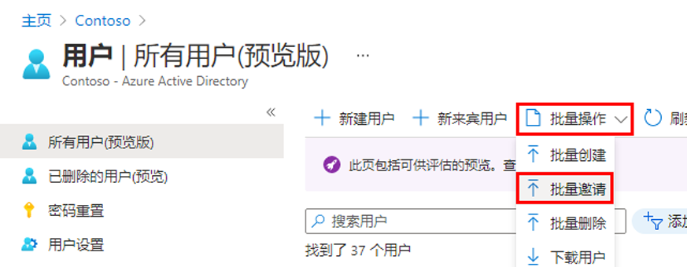
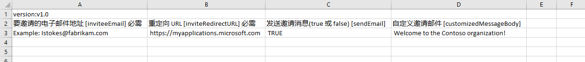
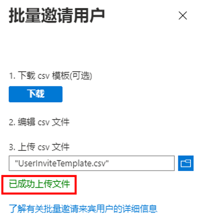
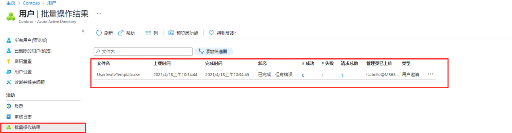

---
lab:
    title: '10 - 批量邀请来宾用户'
    learning path: '01'
    module: '模块 03 - 实现和管理外部标识'
---

# 实验室 10：批量邀请来宾用户

## 实验室场景

最近与另一家公司建立了合作伙伴关系。目前，合作伙伴公司的员工将作为来宾添加。需要确保你可一次性导入多个来宾用户。

#### 预计用时：10 分钟

## 批量邀请来宾用户

1. 以全局管理员身份登录到 [https://portal.azure.com](https://portal.azure.com)。

1. 在导航窗格中，选择 **“Azure Active Directory”**。

1. 在 **“管理”** 下，选择 **“用户”**。

1. 在“用户”边栏选项卡上的菜单上，选择 **“批量操作” > “批量邀请”**。

     

1. 在“批量邀请用户”窗格中，选择 **“下载”** 到具有邀请属性的示例 CSV 模板。

1. 使用编辑器查看 CSV 文件，查看模板。

1. 打开 .csv 模板，为每个来宾用户添加一行。必需的值为：

    - **要邀请的电子邮件地址** - 会收到邀请的用户

    - **重定向 URL** - 用于在受邀用户接受邀请后将其转发到的 URL。

    

1. 保存文件。

1. 在“批量邀请用户”页中，在 **“上传 csv 文件”** 下，浏览到该文件。

选择该 .csv 文件后，对其的验证就会开始。

1. 验证文件内容后，你将看到 **“文件成功上传”**。如果有错误，必须修正错误，然后才能提交作业。

    

1. 文件通过验证以后，请选择 **“提交”**，开始用于添加邀请的 Azure 批量操作。

1. 若要查看作业状态，请选择 **“单击此处查看每项操作的状态”**。也可在“活动”部分中选择 **“批量操作结果”**。要详细了解批量操作中每个行项，请选择 **“成功数”**、**“失败数”** 或 **“请求总数”** 列下的值。如果失败，则会列出失败原因。

    

1. 作业完成后，会显示一条通知，指出批量操作成功。
