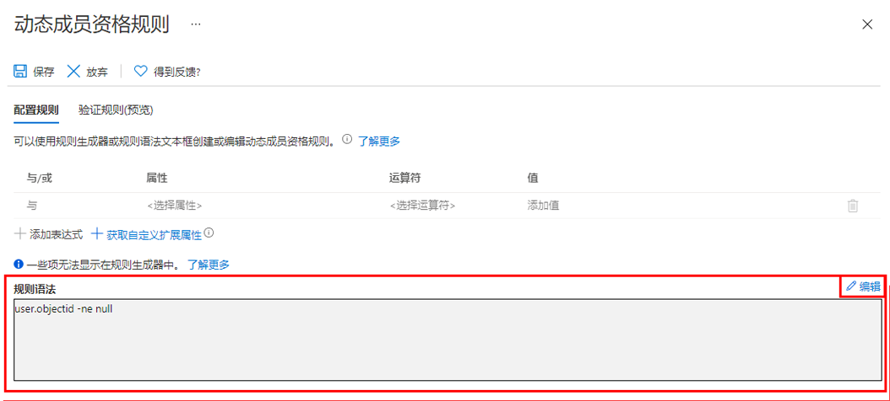

---
lab:
    title: '11 - 使用动态组'
    learning path: '01'
    module: '模块 03 - 实现和管理外部标识'
---

# 实验室 11：使用动态组

## 实验室场景

随着公司发展，手动组管理正在变得过于耗时。由于对目录进行了标准化，现在可以利用动态组。必须创建新的动态组以确保准备好在生产环境中创建动态组。

#### 预计用时：10 分钟

## 练习 1 - 创建将所有用户添加为成员的动态组

### 任务 1 - 创建动态组

1. 使用分配有租户中的全局管理员或用户管理员角色的帐户登录 [https://portal.azure.com](https://portal.azure.com)。

2. 选择“**Azure Active Directory**”。

3. 在“**管理**”下，选择“**组**”，然后选择“**新建组**”。

4. 在“新建组”页面的“**组类型**”下，选择“**安全性**”。

5. 在“**组名**”框中，输入“**SC300-myDynamicGroup**”。

6. 选择“**成员身份类型**”菜单，然后选择“**动态用户**”。

7. 在“**动态用户成员**”下，选择“**添加动态查询**”。

8. 在“**规则语法**”框上方的右侧，选择“**编辑**”。

9. 在“编辑规则语法”窗格的“**规则语法**”框中，输入以下表达式：

    ```powershell
    user.objectid -ne null
    ```

    **警告** - `user.objectid` 区分大小写。

10. 选择“**确定**”。规则会出现在“规则语法”框中。

    

11. 选择“**保存**”。新的动态组现在包括 B2B 来宾用户以及成员用户。

12. 在“新建组”页上，选择“**创建**”以创建组。

### 任务 2 - 验证是否已添加成员

1. 单击 `Azure Active Directory` **主页**。
2. 启动 **Azure Active Directory**。
3. 在“**管理**”菜单中单击“**组**”。
4. 在筛选框中键入“**SC300**”，此时将列出新创建的组。
5. 单击“**SC300-myDynamicGroup**”以打开组。
6. 请注意，该组显示包含 30 多个**直接成员**。
7. 在“**管理**”菜单中单击“**成员**”。
8. 查看成员。

### 任务 3 - 试验替代规则

1. 尝试创建仅包含**来宾**用户的组：
   - (user.objectid -ne null) 和 (user.userType -eq "Guest")

2. 尝试创建仅包含 Azure AD 用户**成员**的组。
   - (user.objectid -ne null) 和 (user.userType -eq "Member")
