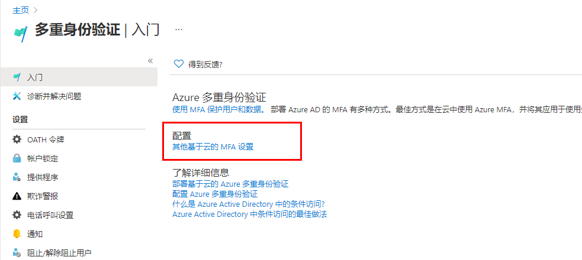
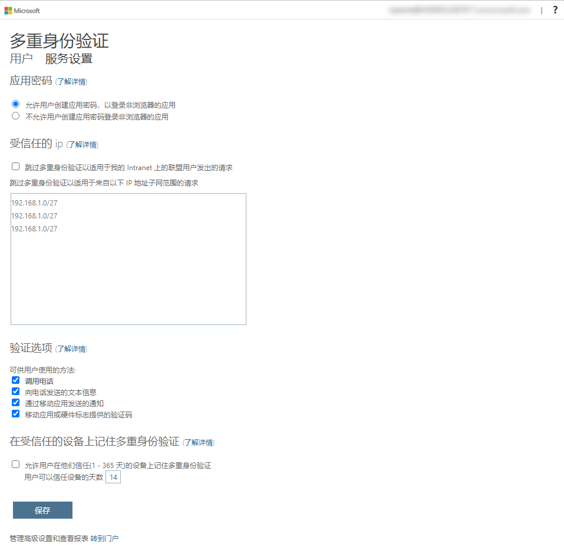
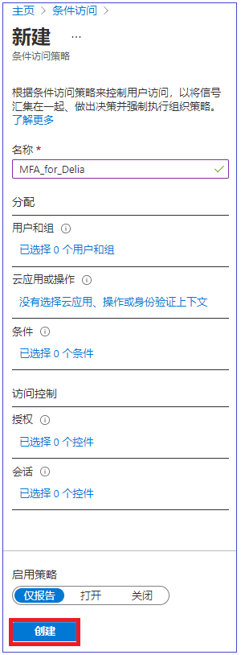
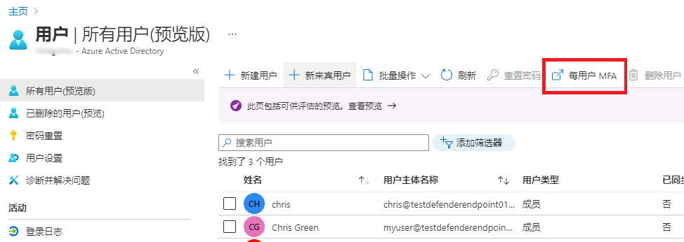
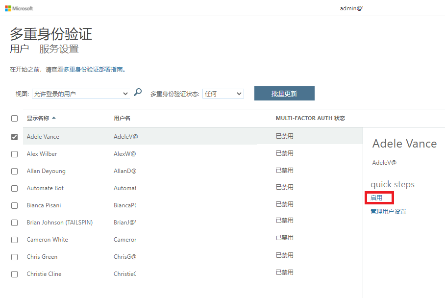

---
lab:
    title: '12 - 启用 Azure AD 多重身份验证'
    learning path: '02'
    module: '模块 01 - 计划和实现 Azure 多重身份验证'
---

# 实验室 12 - 启用 Azure AD 多重身份验证

## 实验室场景

为了提高组织中的安全性，你被要求启用 Azure Active Directory 的多重身份验证。

#### 预计用时：15 分钟

**重要提示** - 本练习需要 Azure AD Premium 许可证。

## 练习 1 - 在 Azure 中查看和启用多重身份验证

### 任务 1 - 查看 Azure 多重身份验证选项

1. 浏览到 [https://portal.azure.com](https://portal.azure.com)，使用目录的全局管理员帐户登录。

2. 使用搜索功能，搜索“**多重身份验证**”。

3. 在搜索结果中，选择“**多重身份验证**”。

4. 在“开始使用”页面中的“**配置**”下，选择“**其他基于云的 MFA 设置**”。

    

5. 在新的浏览器页面中，可看到适用于 Azure 用户的 MFA 选项和服务设置。

    

    可以在此处选择受支持的身份验证方法，在上面的屏幕中，所有方法均已选中。

    还可以在此处启用或禁用应用密码，以使用户可以为不支持多重身份验证的应用创建唯一的帐户密码。此功能使用户可以使用特定于该应用的其他密码通过其 Azure AD 标识进行身份验证。

### 任务 2 - 为 Delia Dennis 设置 MFA 的条件访问规则

接下来，让我们研究如何设置条件访问策略规则，此类规则将对访问网络上的特定应用的来宾用户强制执行 MFA。

1. 切换回 Azure 门户并依次选择“**Azure Active Directory**” > “**安全性**” > “**条件访问**”。

2. 在菜单中选择“**新建策略**”。

    

3. 为策略命名，例如 **MFA_for_Delia**。

4. 在“分配”下，选择“**用户和组**”。

    - 选择“**已选择 0 个用户和组**”  
    - 在屏幕右侧选择“**选择用户和组**”复选框以进行配置。
    - 检查“**用户和组**”（可用用户将填充到右侧）
    - 从用户列表中选择“**Delia Dennis**”，然后选择“**选择**”按钮。

5. 选择“**云应用或操作**”。

    - 在下拉列表中，确保选择了“**云应用**”。
    - 在“包含”下，标记“**所有云应用**”并注意弹出的关于可能会将自己锁定的警告。 
    - 现在在“包含”下，将选择更改为“**选择应用**”项。
    - 在新打开的对话框中，选择“**Office 365**”。
        - **提醒** - 在前面的实验室中，我们为 Delia Dennis 提供了 Office 365 许可证并进行了登录以确保该许可证有效。
    - 选择“**选择**”。

6. 查看“条件”部分。

    - 选择“**位置**”，然后将其配置为“**任意位置**”。

7. 在“**访问控制**”下，选择“**授予**”，然后验证是否已选择“**授予访问权限**”。

8. 选中“**需要多重身份验证**”复选框以强制实施 MFA。

9. 确保选择了“**需要所有选定的控件**”。

10. 选择“**选择**”。

11. 将“**启用策略**”设置为“**开**”。

12. 点击“**创建**”以创建策略。

    

    现已为所选的用户和应用程序启用了 MFA。下次来宾尝试登录该应用时，系统将提示他们注册 MFA。

### 任务 3 - 测试 Delia 的登录情况

1. 打开一个新的 InPrivate 浏览窗口。
2. 连接到 https://www.office.com。
3. 单击“登录”选项。
4. 输入“**DeliaD@** `<<your domain address>>`”。
5. 输入密码 = **pass@word123**。
6. 此时会出现两种情况中的一种。  你应该会收到一条消息，提示你需要设置 Authenticator 应用并注册 MFA。  请使用个人电话按照提示操作以完成注册。  备注 - 你也可能会收到一条提示登录失败的消息，其中包含有关如何继续的若干选项。  在这种情况下，单击“**重试**”选项。

可以看到，由于为 Delia 创建了条件访问规则，因此启动 Office 365 主页需要 MFA。

## 练习 2 - 配置登录所需的 MFA

### 任务 1 - 配置 Azure AD 基于用户的 MFA

最后，我们介绍如何为用户帐户配置 MFA。这是获取多重身份验证设置的另一种方法。

1. 切换回 Azure 门户中的“Azure Active Directory”仪表板。

2. 选择“**用户**”。

3. 在“用户”窗格的顶部，选择“**每用户 MFA**”。

    

4. 此时将打开一个新的浏览器选项卡/窗口，其中包含一个“多重身份验证用户设置”对话框。

    可以通过选择一位用户，然后使用右侧的快捷步骤，为用户启用或禁用 MFA。

    

5. 选择带有复选标记的“**Adele Vance**”。
6. 在快捷步骤下选择“**启用**”选项。
7. 如果出现通知弹出窗口，请阅读该通知，然后选择“**启用多重身份验证**”按钮。
8. 选择“**关闭**”。
9. 请注意，Adele 的 MFA 状态现在为“**已启用**”。
10. 可以选择“**服务设置**”以查看 MFA 设置屏幕，如之前实验室所示。
11. 关闭“MFA 设置”选项卡。

### 任务 2 - 尝试以 Adele 身份登录

1. 如果想看关于 MFA 登录过程的其他示例，可以尝试以 Adele 身份登录。
