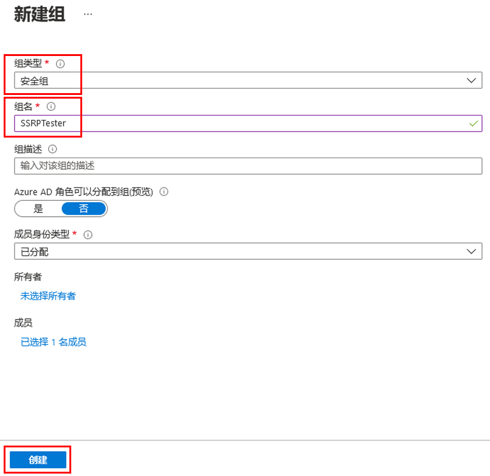
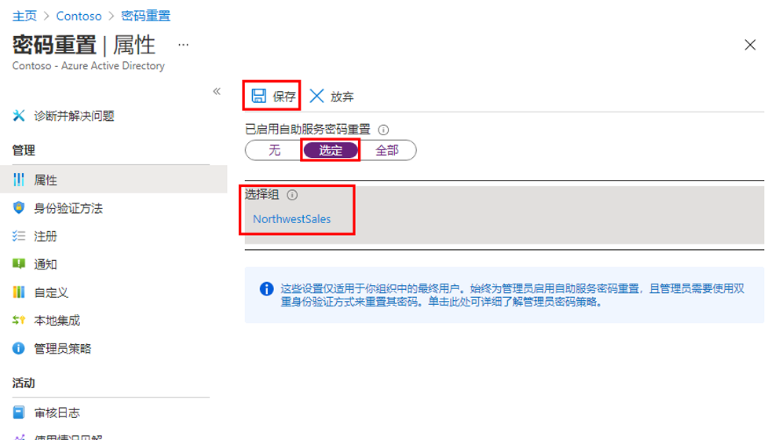
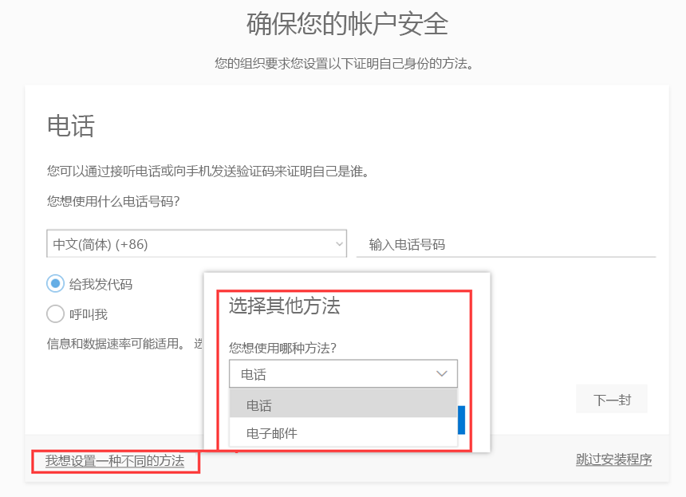
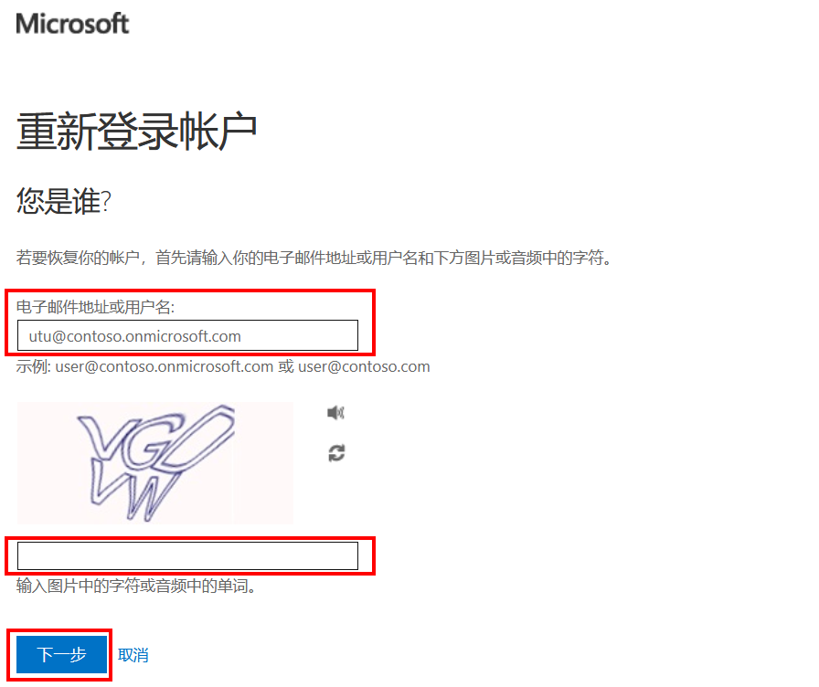
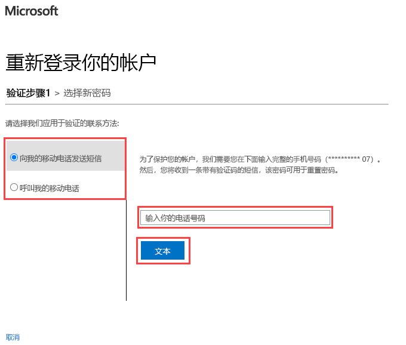

---
lab:
    title: '13 - 启用 Azure AD 自助式密码重置'
    learning path: '02'
    module: '模块 02 - 管理用户身份验证'
---

# 实验室 13 - 配置和部署自助式密码重置
## 实验室场景

公司已决定为员工提供支持，并启用自助式密码重置。你需要在组织中配置此设置。

#### 预计用时：15 分钟

## 练习 1 - 创建启用 SSPR 的组并添加用户

### 任务 1 - 创建要将 SSPR 分配到其中的组

需要先向人数有限的一组用户推送 SSPR，以确保 SSPR 配置按预期工作。我们先来创建一个用于部分推广的安全组，并向该组添加用户。

1. 在 Azure Active Directory 边栏选项卡中的“**管理**”下，选择“**组**”并在右侧窗口中选择“**+ 新建组**”。

2. 使用以下信息创建新组：

    | **设置**| **值**|
    | :--- | :--- |
    | 组类型| 安全性|
    | 组名| SSPRTesters|
    | 组说明| SSPR 推广测试人员|
    | 成员身份类型| 已分配|
    | 成员| Alex Wilber |
    | |  Allan Deyoung |
    | | Bianca Pisani |
  
    
3. 选择“**创建**”。

    

### 任务 2 - 为测试组启用 SSPR

为组启用 SSPR。

1. 浏览回“Azure Active Directory”边栏选项卡。

2. 在“**管理**”下，选择“**密码重置**”。

3. 在“密码重置”边栏选项卡的“属性”页上，在“**已启用自助式密码重置**”下，选择“**选定**”。

4. 选择“**选择组**”。

5. 在默认密码重置策略窗格中，选择“**SSPRTesters**”组。

6. 在“密码重置”边栏选项卡的“属性”页上，选择“**保存**”。

    

7. 在“**管理**”下，选择并查看“**身份验证方法**”、“**注册**”、“**通知**”和“**自定义**”设置的默认值。

    **备注：** 虽然选择“**电话**”作为本实验室其余部分的身份验证方法很重要，但也可使用其他选项。

### 任务 3 - 使用 Alex 注册 SSPR

现在已完成 SSPR 配置，接下来可以为创建的用户注册移动电话号码。

1. 打开其他浏览器，或打开 InPrivate 或 Incognito 浏览器会话，然后浏览到 [https://aka.ms/ssprsetup](https://aka.ms/ssprsetup)。

    这是为了确保系统能提示你进行用户身份验证。

2. 以 **AlexW@** `<<organization-domain-name>>.onmicrosoft.com` 身份登录，密码 = **pass@word123**。

    **备注** - 请将“组织域名”替换为你的域名。

3. 如果系统提示更新密码，请输入所选的新密码。请确保记下新密码。

4. 在“**需要更多信息**”对话框中，选择“**下一步**”。

5. 在“保护帐户安全”页上，使用“**电话**”选项。

    

    **备注** - 在本实验室中，你将使用“**电话**”选项。输入移动电话详细信息。

6. 在“电话号码”字段中输入个人手机号码。
7. 选择“**以短信形式向我发送验证码**”。
8. 选择“**下一步**”。

9. 在移动电话上收到验证码后，在文本框中输入该验证码，然后选择“**下一步**”。

10. 注册手机后，依次选择“**下一步**”和“**完成**”。

11. 关闭浏览器。无需完成登录过程。

### 任务 4 - 测试 SSPR

现在来测试用户是否可以重置其密码。

1. 打开其他浏览器，或打开 InPrivate 或 Incognito 浏览器会话，然后浏览到 [https://portal.azure.com](https://portal.azure.com)。

    这是为了确保系统能提示你进行用户身份验证。

2. 输入 **AlexW@** `<<organization-domain-name>>.onmicrosoft.com`，然后选择“**下一步**”。

    **备注** - 请将“组织域名”替换为你的域名。

3. 在“输入密码”页上，选择“**忘记密码**”。

4. 在“重新登录帐户”页上，填写要求填写的信息，然后选择“**下一步**”。

    

5. 在“**验证步骤 1**”任务中，选择“**向我的移动电话发送短信**”，输入你的电话号码，然后选择“**发送短信**”。

    

6. 输入验证码，然后选择“**下一步**”。

7. 在“选择新密码”步骤中，输入并确认新密码。  建议密码 = **Pass@w.rd1234**。

8. 完成后，选择“**完成**”。

9. 使用创建的新密码以 **AlexW** 身份登录。

10. 输入验证码，然后验证是否可以完成登录过程。

11. 完成后，关闭浏览器。

### 任务 5 - 如果尝试使用 SSPRTesters 组之外的用户会怎样？

1. 在测试中，打开一个新的 InPrivate 浏览器窗口并尝试以 GradyA 身份登录到 Azure 门户，然后选择“**忘记密码**”选项。
