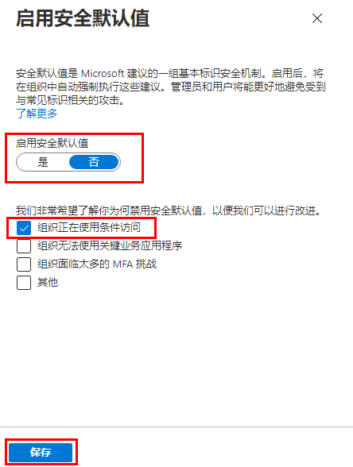

---
lab:
    title: '14 - 启用 Azure AD 多重身份验证'
    learning path: '02'
    module: '模块 03 - 计划、实现和管理条件访问'
---

# 实验室 14 - 使用安全默认值

## 实验室场景

你需要在组织中配置 Azure Active Directory 安全默认值设置。
    **这是一个完全可选的实验室！**  若只是为了查找菜单选项的位置，可以启用/禁用安全默认值。  但要记住的要点来自培训。  请注意，如果启用了安全默认值，但不禁用它，则涉及条件访问的后续实验室将无法使用。

#### 预计用时：7 分钟

### 练习 - 准备工作

必须删除或禁用所有现有的条件访问策略，才能启用安全默认值。请注意，在上一个实验室中，我们构建了一个策略来强制执行 MFA for Delia。你需要先禁用此策略，然后才能执行以下步骤。

1. 登录到 Azure 门户。
2. 打开 Azure Active Directory。
3. 从菜单的“安全性”部分选择“**安全性**”，然后选择“**条件访问**”。
4. 单击设置为“开”或“仅报表”的任何条件访问策略，并将其更改为“关”。

## 启用安全默认值

若要在目录中启用安全默认值，请执行以下操作：

1. 浏览到 [https://portal.azure.com](https://portal.azure.com)，使用目录的全局管理员帐户登录。

1. 选择“**显示门户菜单**”汉堡图标，然后选择“**Azure Active Directory**”。

    

1. 在左侧导航栏的“管理”部分中，选择“**属性**”。

1. 在“属性”边栏选项卡底部，选择“**管理安全默认值**”。

1. 将“**启用安全默认值**”切换开关设置为“**是**”。

1. 可能已启用此选项。

1. 选择“**保存**”。

### 禁用安全默认值

选择实现条件访问策略来取代安全默认值的组织必须禁用安全默认值。

若要在目录中禁用安全默认值，请执行以下操作：

1. 浏览到 [https://portal.azure.com](https://portal.azure.com/)，使用目录的全局管理员帐户登录。

1. 选择“**显示门户菜单**”汉堡图标，然后选择“**Azure Active Directory**”。

1. 在“属性”边栏选项卡底部，选择“**管理安全默认值**”。

1. 将“**启用安全默认值**”切换开关设置为“**否**”。

    

1. 选择“**保存**”。
