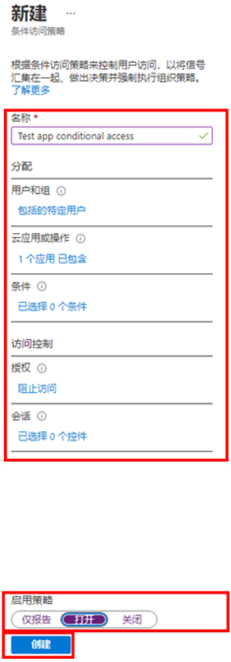
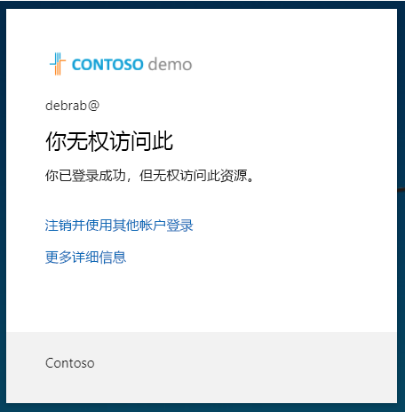

---
lab:
    title: '15 - 实现和测试条件访问策略'
    learning path: '02'
    module: '模块 03 - 计划、实现和管理条件访问'
---

# 实验室 15 - 实现和测试条件访问策略

## 实验室场景

你的组织需要能够限制用户对其内部应用程序的访问。你需要部署 Azure Active Directory 条件访问策略。

#### 预计用时：12 分钟

## 练习 1 - 设置条件访问策略以阻止 DebraB 访问 Yammer

### 任务 1 - 确认 DebraB 可以访问 Yammer

1. 启动一个新的 InPrivate 浏览器窗口。
2. 连接到 [https://www.office.com](https://www.office.com) 
3. 出现提示时，以 DebraB 身份登录：

    | 设置 | 值 |
    | :--- | :--- |
    | 用户名 | **DebraB@** `<<your lab domain>>.onmicrosoft.com` |
    | 密码 | **pass@word123** |
    
4. 单击 Yammer 图标以查看它是否正确加载。

## 任务 2 - 创建条件访问策略

Azure Active Directory 条件访问是一项 Azure AD 高级功能，可用于指定控制谁可以访问资源的详细策略。使用条件访问，可以通过基于组、设备类型、位置和角色等限制用户的访问来保护应用程序。

1. 浏览到 [https://portal.azure.com](https://portal.azure.com)，使用目录的全局管理员帐户登录。

2. 打开门户菜单，然后选择“**Azure Active Directory**”。

3. 在“Azure Active Directory”边栏选项卡的“**管理**”下，选择“**安全性**”。

4. 在“安全性”边栏选项卡的左侧导航栏中，选择“**条件访问**”。

5. 在顶部菜单上，选择“**+ 新建策略**”。

    

6. 在“**名称**”框中，输入“**阻止 DebraB 登录 Yammer**”。

    **备注** - 使用此命名可帮助你快速识别策略及其功能。

7. 在“**分配**”下，选择“**用户和组**”。

8. 在“包括”选项卡上，选中“**用户和组**”复选框。

9. 在“选择”窗格中，选择“**DebraB**”帐户，然后选择“**选择**”。

10. 选择“**云应用或操作**”。

11. 确认已选择“**云应用**”，然后选择“**选择应用**”。

12. 在“选择”窗格中，搜索“**Yammer**”并选择“**Office 365 Yammer**”，然后选择“**选择**”。

13. 在“**访问控制**”下，选择“**授予**”。

14. 在“授予”窗格中，选择“**阻止访问**”，然后选择“**选择**”。

    **备注** - 此策略仅配置用于练习，以及用于快速演示条件访问策略。

15. 在“**启用策略**”下，选择“**启用**”，然后选择“**创建**”。

    

## 任务 3 - 测试条件访问策略

你应该测试条件访问策略，以确保它们按预期工作。

1. 打开一个新的“Inprivate”浏览器选项卡，然后浏览到 [https://www.yammer.com/office365](https://www.yammer.com/office365)。
     - 出现提示时，以 DebraB 身份登录：

    | 设置 | 值 |
    | :--- | :--- |
    | 用户名 | **DebraB@** `<<your lab domain>>.onmicrosoft.com` |
    | 密码 | **pass@word123** |
      
2. 验证你已成功阻止访问 Microsoft Yammer。

    

3. 如果你已登录，请关闭选项卡，等待 1 分钟，然后重试。
    
     **备注** - 如果以 DebraB 的身份自动登录到 Yammer，则需要手动注销。  凭据/访问权限已缓存。  注销并登录后，Yammer 会话应会拒绝访问。

4. 关闭选项卡并返回到“条件访问”边栏选项卡。

5. 选择“**Yammer 条件访问**”策略。

6. 在“**启用策略**”下，选择“**禁用**”，然后选择“**保存**”。
