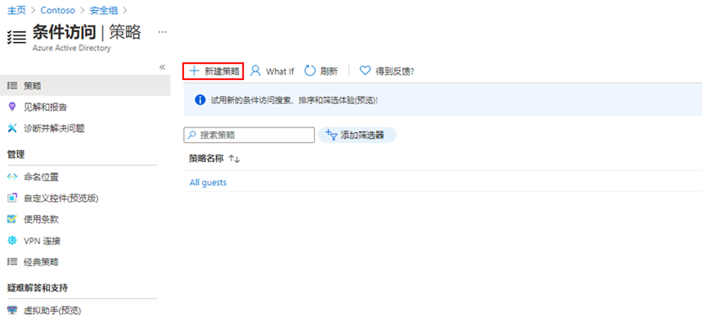
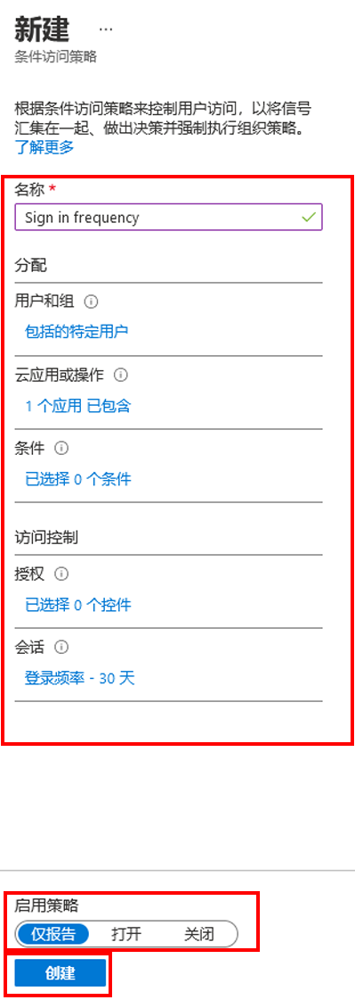

---
lab:
    title: '16 - 配置身份验证会话控件'
    learning path: '02'
    module: '模块 03 - 计划、实现和管理条件访问'
---

# “实验室 16 - 配置身份验证会话控件”

## 实验室场景

作为你所在公司的大型安全配置的一部分，你需要测试可用于控制登录频率的条件访问策略。

#### 预计用时：10 分钟

## 使用条件访问策略配置登录频率控制

1. 浏览到 [https://portal.azure.com](https://portal.azure.com)，使用目录的全局管理员帐户登录。

1. 打开门户菜单，然后选择“**Azure Active Directory**”。

1. 在“**Azure Active Directory**”边栏选项卡的“**管理**”下，选择“**安全性**”。

1. 在“安全性”边栏选项卡的左侧导航栏中，选择“**条件访问**”。

1. 在顶部菜单中选择“**新建策略**”。

    

1. 在“**名称**”框中，输入“**登录频率**”。

1. 在“**分配**”下，选择“**用户和组**”。

1. 在“包括”选项卡上，选中“**用户和组**”复选框。

1. 在“选择”窗格中，选择“**Grady Archie**”帐户，然后选择“**选择**”。

1. 选择“**云应用或操作**”。

1. 确认已选择“**云应用**”，然后选择“**选择应用**”。

1. 在“**选择**”窗格中，选择“**Office 365**”，然后选择“**选择**”。

1. 在“**访问控制**”下，选择“**会话**”。

1. 在“**会话**”窗格中，选择“**登录频率**”。

1. 在“值”框中，输入“**30**”。

1. 依次选择单位菜单、“**天数**”，然后选择“**选择**”。

1. 在“**启用策略**”下，选择“**仅限报告**”，然后选择“**创建**”。

    

   **备注** - “仅限报告”模式是一种新的条件访问策略状态，允许管理员在环境中启用条件访问策略之前评估其影响。随着仅限报告模式的发布：
    
    - 可在仅限报告模式中启用条件访问策略。
    - 在登录期间，将评估仅限报告模式中的策略，但不会强制执行该策略。
    - 结果记录在登录日志详细信息的“条件访问”和“仅限报告”选项卡中。
    - 具有 Azure Monitor 订阅的客户可以使用条件访问见解工作簿来监视其条件访问策略产生的影响。
