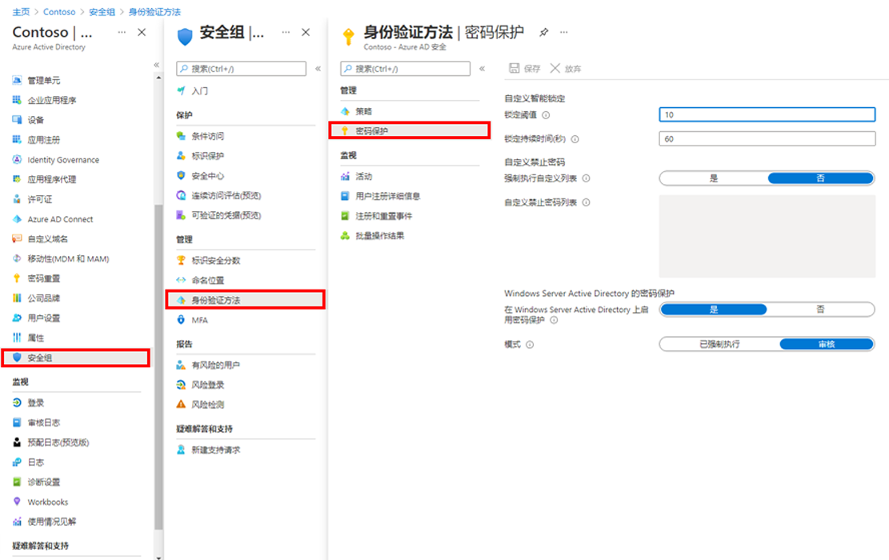

---
lab:
    title: '17 - 管理 Azure AD 智能锁定值'
    learning path: '02'
    module: '模块 03 - 计划、实现和管理条件访问'
---

# 实验室 17 - 管理 Azure AD 智能锁定值

## 实验室场景

你需要为组织配置附加密码保护设置。

#### 预计用时：5 分钟

## 管理 Azure AD 智能锁定值

根据组织要求，可以自定义 Azure AD 智能锁定值。要使用组织特定的值自定义智能锁定设置，需要向用户提供 Azure AD Premium P1 或更高版本的许可证。

1. 浏览到 [https://portal.azure.com](https://portal.azure.com)，使用目录的全局管理员帐户登录。

1. 打开门户菜单，然后选择“**Azure Active Directory**”。

1. 在“**Azure Active Directory**”边栏选项卡的“**管理**”下，选择“**安全性**”。

1. 在“安全性”边栏选项卡的左侧导航栏中，选择“**身份验证方法**”。

1. 在左侧导航栏中，选择“**密码保护**”。

    

1. 在“密码保护”设置的“**锁定持续时间(秒)**”框中，将值设置为“**120**”。

1. 在“**模式**”旁边，选择“**强制执行**”。

1. 保存你的更改。

    **备注** - 触发智能锁定阈值后，你将在帐户被锁定时收到以下消息：
    - 帐户暂时锁定以防止未经授权的使用。请稍后再试！如果仍有问题，请与管理员联系。
