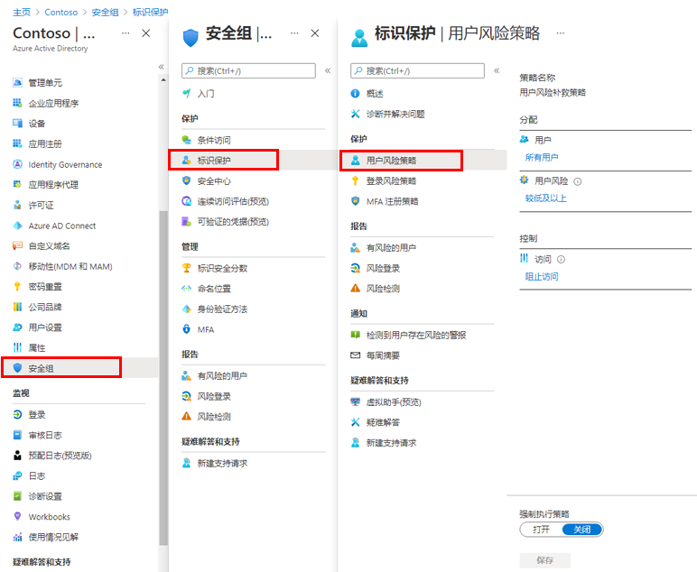

---
lab:
    title: '18 - 启用登录和用户风险策略'
    learning path: '02'
    module: '模块 04 - 管理 Azure AD 标识保护'
---

# 实验室 18 - 启用登录和用户风险策略

## 实验室场景

你需要启用和配置 Azure AD 组织的登录和用户风险策略，以提供额外的安全层。

#### 预计用时：10 分钟

## 启用用户风险策略

1. 使用全局管理员帐户登录到 [https://portal.azure.com]( https://portal.azure.com)。

1. 打开门户菜单，然后选择“**Azure Active Directory**”。

1. 在“Azure Active Directory”边栏选项卡的“**管理**”下，选择“**安全性**”。

1. 在“安全性”边栏选项卡的左侧导航栏中，选择“**标识保护**”。

1. 在“标识保护”边栏选项卡的左侧导航栏中，选择“**用户风险策略**”。

    

1. 在“**分配**”下，选择“**所有用户**”，然后查看可用选项。

1. 你可以选择“**所有用户**”，如果部署受到限制，则可以选择“**选择个人和组**”。

1. 此外，还可以选择从策略中排除用户。

1. 在“**用户风险**”下，选择“**低及以上**”。

1. 在“用户风险”窗格中，选择“**高**”，然后选择“**完成**”。

1. 在“**控制**” > “**权限**”下，选择“**阻止访问**”。

1. 在“访问”窗格中，查看可用选项。

    **提示** - Microsoft 的建议是允许访问和要求更改密码。

1. 选中“**要求更改密码**”复选框，然后选择“**完成**”。

1. 在“**强制执行策略**”下，选择“**启用**”，然后选择“**保存**”。

## 启用登录风险策略

1. 在“标识保护”边栏选项卡的左侧导航栏中，选择“**登录风险策略**”。

1. 与用户风险策略一样，可以将登录风险策略分配给用户和组，并允许从策略中排除用户。

1. 在“**登录风险**”下，选择“**低及以上**”。

1. 在“登录风险”窗格中，选择“**高**”，然后选择“**完成**”。

1. 在“**控制**” > “**权限**”下，选择“**阻止访问**”。

1. 选中“**要求多重身份验证**”复选框，然后选择“**完成**”。

1. 在“**强制执行策略**”下，选择“**启用**”，然后选择“**保存**”。
