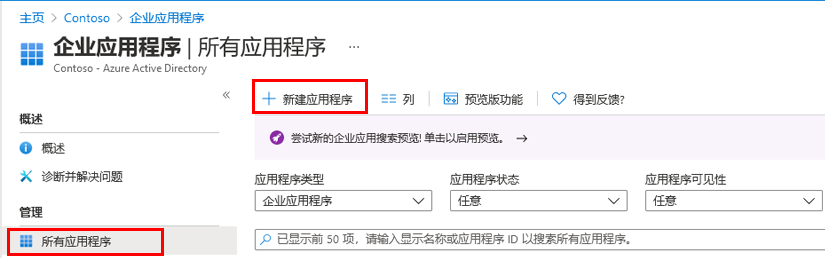
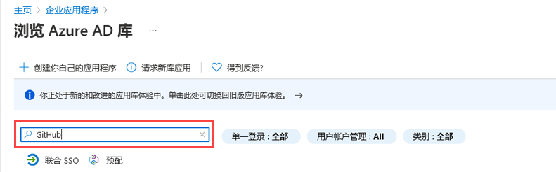
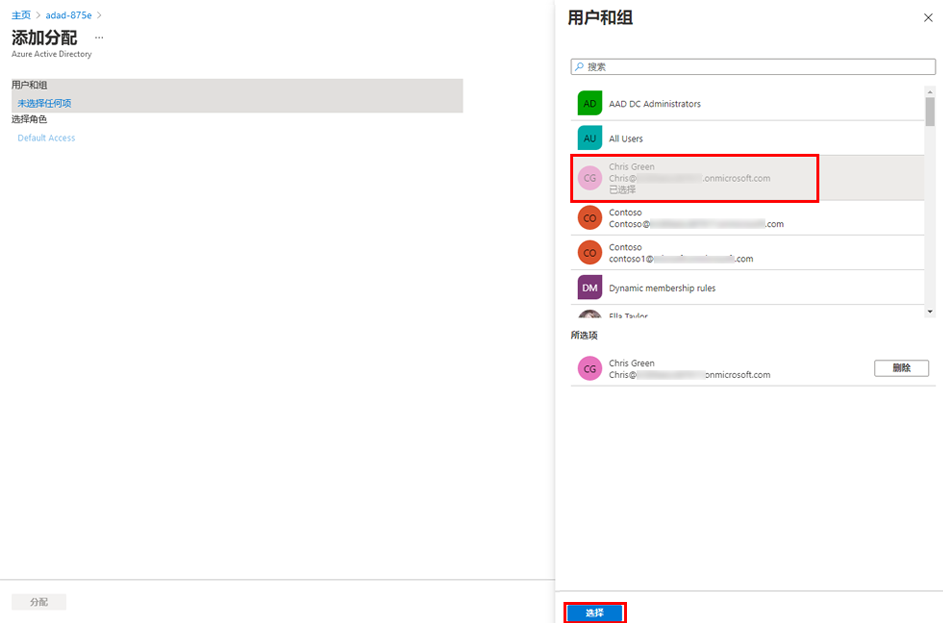

---
lab:
    title: '20 - 实现应用的访问管理'
    learning path: '03'
    module: '模块 01 - 为 SSO 计划和设计企业应用的集成'
---

# 实验室 20 - 实现应用的访问管理

## 实验室场景

你的组织要求仅特定用户或组有权访问企业应用程序。你需要将用户分配到特定应用程序。

#### 预计用时：5 分钟

## 将应用添加到 Azure AD 租户

1. 使用全局管理员帐户登录到 [https://portal.azure.com](https://portal.azure.com)。

1. 打开门户菜单，然后选择 **“Azure Active Directory”**。

1. 在 “Azure Active Directory” 边栏选项卡的 **“管理”** 下，选择 **“企业应用程序”**。

1. 在“企业应用程序”窗格中，选择 **“+ 新建应用程序”**。

    

1. 在“浏览 Azure AD 库(预览)” 边栏选项卡中的 **“搜索应用程序”** 框中，输入 **“GitHub”**。

    

1. 在结果中，选择 **“GitHub Enterprise Cloud – 企业帐户”**。

1. 在 **“GitHub Enterprise Cloud – 企业帐户”** 中，检查设置，然后选择 **“创建”**。

1. 创建帐户后，你将被重定向到 “GitHub Enterprise Cloud – 企业帐户”边栏选项卡。

## 向应用分配用户

1. 在 “GitHub Enterprise Cloud – 企业帐户”边栏选项卡“概述”页面上，在 **“开始”** 下选择 **“1. 分配用户和组”**。

1. 或者，可以在左侧导航的 **“管理”** 下，选择 **“用户和组”**。

1. 在“用户和组”页面的菜单上，选择 **“+ 添加用户/组”**。

1. 在“添加分配”边栏选项卡中，选择  **“用户和组”**。

1. 在“用户和组”窗格中，选择管理员帐户，然后选择 **“选择”**。

    

1. 选择 **“分配”**。
