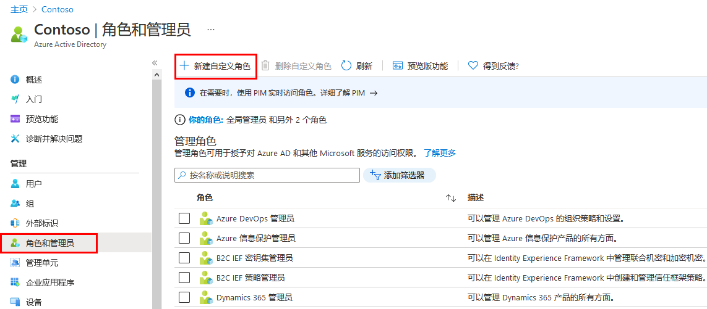
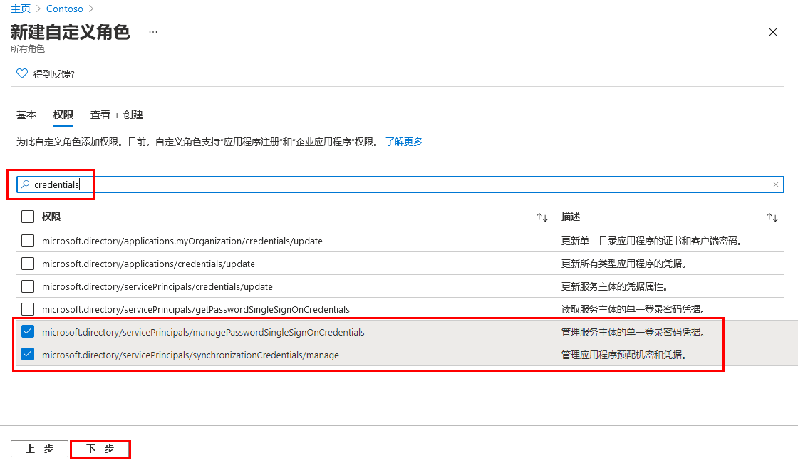

---
lab:
    title: '21 - 创建新的自定义角色以授予管理应用注册的访问权限'
    learning path: '03'
    module: '模块 01 - 为 SSO 计划和设计企业应用的集成'
---

# 实验室 21 - 实现应用的访问管理

## 实验室场景

你需要为应用管理创建新的自定义角色。此新角色只应具有执行凭据管理所需的特定权限。

#### 预计用时：5 分钟

## 创建新的自定义角色以授予管理应用注册的访问权限

1. 使用全局管理员帐户登录到 [https://portal.azure.com](https://portal.azure.com)。

2. 打开门户菜单，然后选择“**Azure Active Directory**”。

3. 在“Azure Active Directory”边栏选项卡的“**管理**”下，选择“**角色和管理员**”。

4. 在“角色和管理员”边栏选项卡的“菜单”上，选择“**新建自定义角色**”。

    

5. 在“新建自定义角色”边栏选项卡中的“基本信息”选项卡上，在“名称”框中输入“**我的自定义应用角色**”。

6. 查看其余选项，然后选择“**下一步**”。

7. 在“权限”选项卡上，查看可用权限。

8. 在“**按权限名称或说明搜索**”框中，输入“**凭据**”。

9. 在结果中选择“**管理**”权限，然后选择“**下一步**”。

    ```
       microsoft.directory/servicePrincipals/managePasswordSingleSignOnCredentials  -   Manage password single sign-on credentials or service principals.
       microsoft.directory/servicePrincipals/synchronizationCredentials/manage    -   Manage application provisioning secrets and credentials.
    ```

    

    **为什么选择这两项** - 对于应用程序预配来说，这两项是为正在创建的应用程序或服务主体启用和强制执行单一登录，并且能够将企业应用程序分配给一组用户或组所需的最低权限。  也可以授予其他权限。  要获取可用权限的完整列表，请访问 `https://docs.microsoft.com/azure/active-directory/roles/custom-enterprise-app-permissions`。

10. 查看更改，然后选择“**创建**”。
