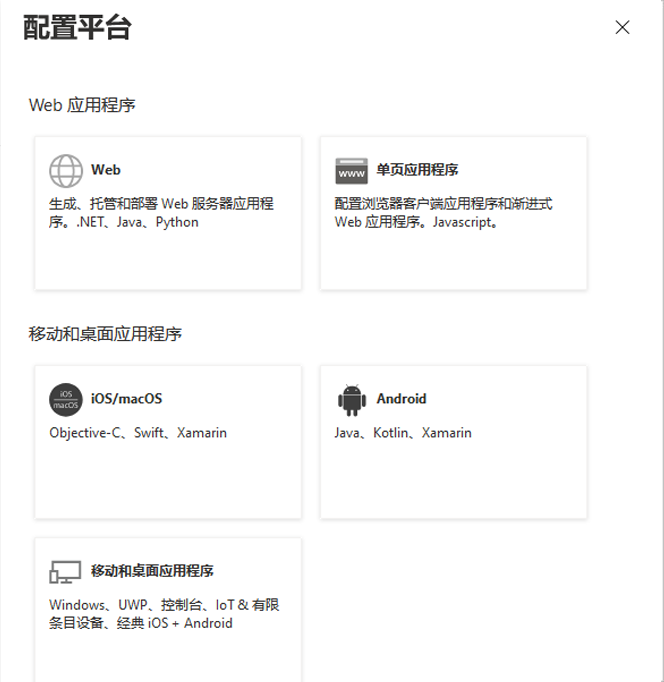
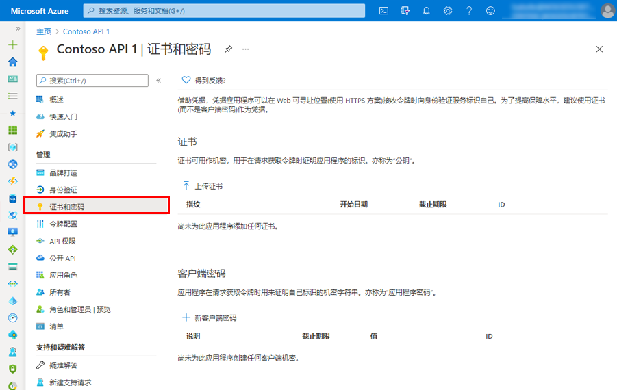
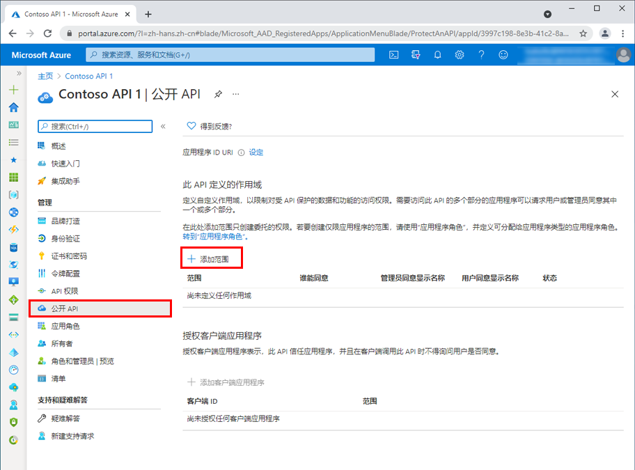
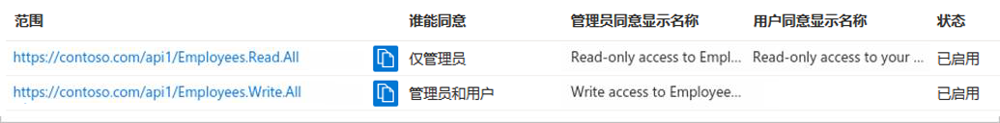

---
lab:
    title: '22 - 注册应用程序'
    learning path: '03'
    module: '模块 03 - 实现应用注册'
---

# 实验室 22 - 注册应用程序

#### 预计用时：20 分钟

## 注册应用程序

注册应用程序会在应用与 Microsoft 标识平台之间建立信任关系。信任是单向的：应用信任 Microsoft 标识平台，但标识平台并不信任应用。

1. 使用全局管理员帐户登录到 [https://portal.azure.com](https://portal.azure.com)。

1. 打开门户菜单，然后选择 **“Azure Active Directory”**。

1. 在 “Azure Active Directory” 边栏选项卡中的 **“管理”** 下，选择 **“应用注册”**。

1. 在 **“应用注册”** 页面上的菜单中，选择 **“+ 新建注册”**。

1. 在 **“注册应用程序”** 边栏选项卡上，使用默认值注册一个名为 **“演示应用”** 的应用。无需输入重定向 URI。

    

1. 完成后，你将转到 **“演示应用”** 边栏选项卡。

## 添加重定向 URI

重定向 URI 是 Microsoft 标识平台重定向用户客户端并在身份验证后发送安全令牌的位置。例如，在生产 Web 应用中，重定向 URI 通常是在其中运行应用的公共终结点。在开发过程中，通常还会添加用于在本地运行应用的终结点。

1. 配置已注册的应用程序的平台设置，以添加和修改该应用程序的重定向 URI。

## 配置平台设置

在 Azure 门户的 **“平台配置”** 中配置每种应用程序类型的设置（包括重定向 URI）。某些平台（例如 **Web** 和**单页应用程序**）要求手动指定重定向 URI。对于其他平台（例如移动和桌面），可选择在配置其他设置时为用户生成的重定向 URI。

若要根据面向的平台或设备配置应用程序设置，请执行以下操作：

1. 在 Azure 门户的 **“应用注册”** 中选择你的应用程序。

1. 在 **“管理”** 下，选择 **“身份验证”**。

1. 在 **“平台配置”** 下，选择 **“添加平台”**。

1. 在 **“配置平台”** 中，为应用程序类型（平台）选择磁贴，以配置其设置。

    

    | 平台| 配置设置|
    | :--- | :--- |
    | Web| 输入应用的**重定向 URI**，即 Microsoft 标识平台重定向用户客户端并在身份验证后发送安全令牌的位置。为服务器上运行的标准 Web 应用程序选择此平台。|
    | 单页应用程序| 输入应用的**重定向 URI**，即 Microsoft 标识平台重定向用户客户端并在身份验证后发送安全令牌的位置。如果要在 JavaScript 中或使用 Angular、Vue.js、React.js 或 Blazor WebAssembly 等框架构建客户端 Web 应用，请选择此平台。|
    | iOS/macOS| 输入应用**捆绑 ID**，可在 *info.plist* 中的 XCode 或生成设置中找到该 ID。如果指定捆绑 ID，将生成重定向 URI。|
    | Android| 输入应用**包名称**（可在 AndroidManifest.xml 文件中找到），然后生成并输入**签名哈希**。如果指定这些设置，将生成重定向 URI。|
    | 移动和桌面应用程序| 选择建**议的重定向 URI** 之一，或指定**自定义重定向 URI**。对于桌面应用程序，建议：[https://login.microsoftonline.com/common/oauth2/nativeclient](https://login.microsoftonline.com/common/oauth2/nativeclient)。对于不使用最新 Microsoft 身份验证库 (MSAL) 或不使用代理的移动应用程序，请选择此平台。同时也为桌面应用程序选择此平台。|

1. 选择 **“配置”** 以完成平台配置。

## 添加凭据

凭据供访问 Web API 的机密客户端应用程序使用。Web 应用、其他 Web API、服务类型的应用程序和守护程序类型的应用程序都是机密客户端。通过凭据，应用程序可以自己的身份进行身份验证，无需用户在运行时进行任何交互。

可将证书和客户端密码（字符串）作为凭据添加到机密客户端应用注册。

## 添加证书

证书有时被称为*公钥*，它们是推荐的凭据类型，因为它们提供的保证级别比客户端密码高。使用受信任的公共证书时，可使用“证书和密码”功能添加证书。证书必须是以下文件类型之一：.cer、.pem、.crt。

## 添加客户端密码

客户端密码也称为*应用程序密码*，它是应用可用于代替证书来标识自身的一个字符串。在这两种凭据类型中，它使用起来更加轻松。它常常在开发过程中使用，但它的安全性不如证书。应在生产环境中运行的应用程序中使用证书。

1. 在 Azure 门户的 **“应用注册”** 中选择你的应用程序。

1. 选择 **“证书和密码”** > **“新建客户端密码”**。

1. 添加客户端机密的说明。

1. 选择持续时间。

1. 选择 **“添加”**。

1. **记录密码的值**，以供在客户端应用程序代码中使用；离开此页面后，它将*永不再显示*。

## 注册 Web API

若要提供对 Web API 中资源的范围受限访问权限，必须先向 Microsoft 标识平台注册该 API。

1. 执行上述步骤。

1. 跳过 **“添加重定向 URI”** 和 **“配置平台设置”** 部分。无需为 Web API 配置重定向 URI，因为没有用户以交互方式进行登录。

1. 暂时跳过 **“添加凭据”部分**。仅当你的 API 访问下游 API 时，它才需要其自己的凭据 - 本文未涵盖这一场景。

注册 Web API 后，便可以添加范围，API 的代码可使用这些范围向 API 的使用者提供具体权限。

## 添加作用域

客户端应用程序中的代码通过将访问令牌及其请求传递到受保护的资源 (Web API) 来请求执行由 Web API 定义的操作的权限。然后，仅当 Web API 接收的访问令牌包含操作所需的范围（也称为应用程序权限）时，该 API 才会执行请求的操作。

首先，请按照以下步骤创建一个名为 Employees.Read.All 的示例范围：

1. 登录到 Azure 门户。

1. 如果有权访问多个租户，请使用顶部菜单中的 **“目录 + 订阅”** 筛选器，选择包含你的客户端应用注册的租户。

1. 选择 **“Azure Active Directory”** > **“应用注册”**，然后选择 API 的应用注册。

1. 选择 **“公开 API”** > **“添加范围”**。

    

1. 如果尚未配置**应用程序 ID URI**，系统会提示你设置一个。应用 ID URI 充当你将在 API 代码中引用的范围的前缀，它必须是全局唯一的。可使用提供的默认值（格式为 api://\<application-client-id\>），也可指定一个可读性更强的 URI（例如 `https://contoso.com/api`）。

1. 接下来，在 **“添加范围”** 窗格中指定范围的属性。对于本演练，你可以使用示例值或指定自己的值。

    | 字段| 说明| 示例|
    | :--- | :--- | :--- |
    | 范围名称| 范围的名称。公共范围命名约定为 resource.operation.constraint。| Employees.Read.All|
    | 谁可以同意| 此范围是由用户同意，还是由管理员同意。若要获得更高特权，请选择“仅管理员”。| 管理员和用户|
    | 管理员同意显示名称| 仅管理员可以看到的有关范围用途的简短说明。| 对员工记录的只读访问权限|
    | 管理员同意说明| 仅管理员可以看到的范围所授予权限的更详细说明。| 允许应用程序对所有员工数据进行只读访问。|
    | 用户同意显示名称| 范围用途的简短说明。仅当你将“谁可以同意”设置为“管理员和用户”时才向用户显示。| 对员工记录的只读访问权限|
    | 用户同意说明| 范围所授予权限的更详细说明。仅当你将“谁可以同意”设置为“管理员和用户”时才向用户显示。| 允许应用程序对员工数据进行只读访问。|

1. 将 **“状态”** 设置为 **“启用”**，然后选择 **“添加范围”**。

1. （可选）若要取消向应用用户提示同意你定义的范围，可以 *“预授权”* 客户端应用程序访问 Web API。请*仅*预授权所信任的客户端应用程序，因为用户不会有机会拒绝同意。

   1. 在 **“授权的客户端应用程序”** 下，选择 **“添加客户端应用程序”**。

   1. 输入要预授权的客户端应用程序的 **“应用程序(客户端) ID”**。例如，以前注册的 Web 应用程序的 ID。

   1. 在 **“授权范围”** 下，选择要取消显示同意提示的范围，然后选择 **“添加应用程序”**。

   1. 如果按照此可选步骤操作，客户端应用现在就是一个预授权的客户端应用 (PCA)；当用户登录它时，系统将不提示用户授予同意。

## 添加需要管理员同意的范围

接下来，再添加一个名为 Employees.Write.All 的示例范围，只有管理员才能同意该范围。需要管理员同意的范围通常用于提供对更高特权的操作的访问权限，通常由作为后端服务运行的客户端应用程序或不以交互方式登录用户的后台程序使用。

1. 若要添加 Employees.Write.All 示例范围，请按照上述步骤操作，在 **“添加范围”** 窗格中指定以下值：

    | 字段| 示例值|
    | :--- | :--- |
    | 范围名称| Employees.Write.All|
    | 谁可以同意| 仅管理员|
    | 管理员同意显示名称| 对员工记录的写入访问权限|
    | 管理员同意说明| 允许应用程序对所有员工数据进行写入访问。|
    | 用户同意显示名称| 无（留空）|
    | 用户同意说明| 无（留空）|

## 验证公开的范围

如果你已成功添加先前部分中所介绍的两个示例范围，则它们将显示在 Web API 的应用注册的 **“公开 API”** 窗格中，如下图所示：

如图所示，范围的完整字符串由 Web API 的 **“应用程序 ID URI”** 与范围的 **“范围名称”** 串联而成。

例如，如果 Web API 的应用程序 ID URI 为 `https://contoso.com/api`，范围名称为 Employees.Read.All，则完整范围为：

`https://contoso.com/api/Employees.Read.All`

## 使用公开的范围

接下来，你将按照上述步骤配置客户端应用的注册，其中包含对 Web API 的访问权限和你所定义的范围。

向客户端应用注册授予访问 Web API 的权限后，Microsoft 标识平台可以向客户端颁发 OAuth 2.0 访问令牌。当客户端调用 Web API 时，它会提供一个访问令牌，令牌的范围 (scp) 声明设置为你在客户端的应用注册中所指定的权限。

以后可以根据需要公开其他范围。请考虑 Web API 可以公开与多个操作关联的多个范围。在运行时，资源可通过评估其收到的 OAuth 2.0 访问令牌中的范围 (scp) 声明，来控制对 Web API 的访问。
