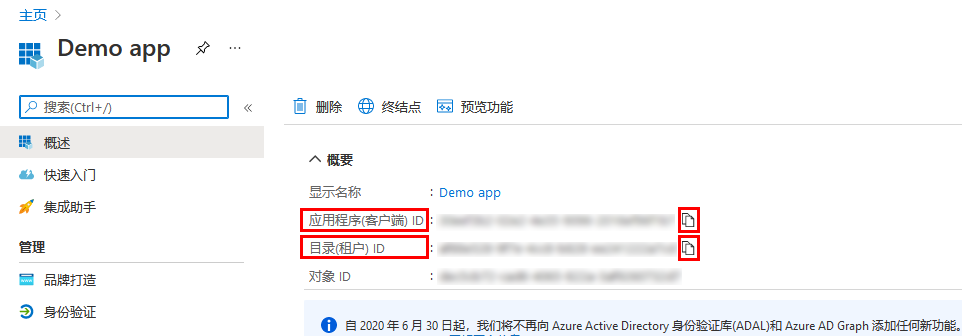
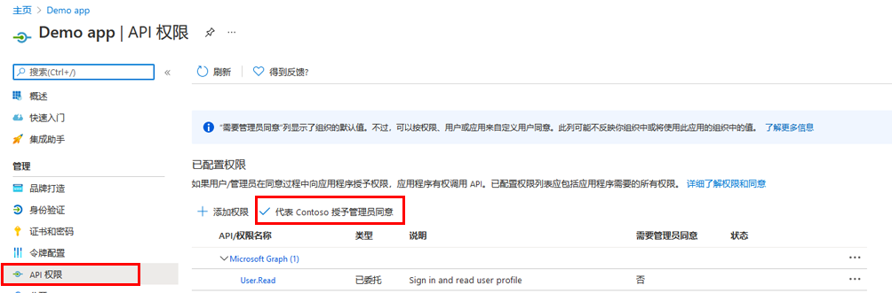
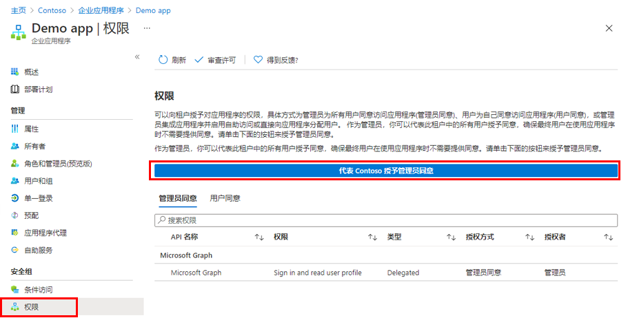

---
lab:
    title: '23 - 向应用程序授予租户范围的管理员同意'
    learning path: '03'
    module: '模块 03 - 实现应用注册'
---

# 实验室 23：向应用程序授予整个租户的管理员同意

## 实验室场景

对于组织开发的应用程序，或者已直接在 Azure AD 租户中注册的应用程序，可通过 Azure 门户中的“应用注册”授予整个租户的管理员同意。

#### 预计用时：10 分钟

## 在应用注册中授予管理员同意

> **警告**
> 向某个应用程序授予租户范围的管理员同意将为该应用及其发布者授予对组织数据的访问权限。在授予同意前，仔细检查应用程序请求的权限。

需要全局管理员角色，以便为 Microsoft Graph API 授予对应用程序权限的管理员同意。

1. 在上一练习中，你创建了一个名为“演示应用”的应用。如有必要，请在 Microsoft Azure 中，浏览到“**Azure Active Directory”>“应用注册”>“演示应用**”。

1. 在“**演示应用**”边栏选项卡上，找到并复制保存每个**应用程序（客户端）ID** 和**目录（租户）ID**，以便稍后可使用。

    

1. 在左侧导航栏中，在“**管理**”下选择“**API 权限**”。

1. 在“**已配置的权限**”下，选择“**授予管理员同意**”。

    

1. 查看对话框，然后选择“**是**”。

    > **警告**
    > 通过“应用注册”授予租户范围的管理员同意将撤销先前已授予的租户范围的所有权限。之前用户自己授予的权限将不受影响。

## 在企业应用中授予管理员同意

如果已在租户中预配了企业应用程序，可通过该应用程序授予租户范围的管理员同意。

1. 在 Microsoft Azure 中，浏览到“**Azure Active Directory”>“企业应用程序”>“演示应用**”。

1. 在“**演示应用**”边栏选项卡的左侧导航栏中，在“**安全性**”下选择“**权限**”。

1. 在“**权限**”下，选择“**授予管理员同意**”。

    

    > [!警告]
    > 警告
    > 通过“应用注册”授予租户范围的管理员同意将撤销先前已授予的租户范围的所有权限。之前用户自己授予的权限将不受影响。

1. 出现提示时，使用全局管理员帐户登录。

1. 在“**请求的权限**”对话框中，查看信息，然后选择“**接受**”。
