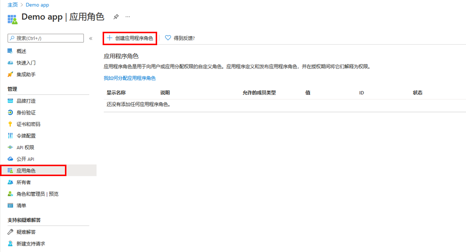

---
lab:
    title: '24- 向应用添加应用角色并在令牌中接收它们'
    learning path: '03'
    module: '模块 03 - 实现应用注册'
---

# 实验室 24：向应用添加应用角色并在令牌中接收它们

## 实验室场景

基于角色的访问控制 (RBAC) 是一种常用的机制，用于在应用程序中强制进行授权。使用 RBAC 时，管理员将权限授予角色而不是单个用户或组。然后，管理员再将角色分配给不同的用户和组，以控制谁可以访问哪些内容和功能。你计划实现 RBAC 角色，并且需要验证你了解如何执行相关过程。

#### 预计用时：10 分钟

## 使用应用角色 UI 声明应用角色

>[!重要说明]
应用角色门户 UI 功能现为公共预览版。此预览版在提供时未附带服务级别协议，建议不要用于生产工作负载。某些功能可能不受支持或者受限。

若要使用 Azure 门户的用户界面创建应用角色，请执行以下操作：

1. 使用全局管理员帐户登录到 [https://portal.azure.com](https://portal.azure.com)。

2. 打开门户菜单，然后选择“**Azure Active Directory**”。

3. 在“**Azure Active Directory**”边栏选项卡中的“**管理**”下，选择“**应用注册**”。

4. 选择之前创建的“**演示应用**”应用注册项。

5. 选择“**应用角色” | “预览**”，然后选择“**创建应用角色**”。

    

6. 在“**创建应用角色**”窗格的“**显示名称**”框中，输入“**调查作者**”。

7. 在“**允许成员类型**”下，选择“**用户/组**”。

8. 在“**值**”框中，输入 **Survey.Create**。

9. 在“**说明**”框中，输入“**作者可创建调查**”。

10. 请注意，“说明”是必填字段。

11. 验证是否选择了“**是否要启用此应用角色**”，然后选择“**应用**”。

## 将用户和组分配到角色

在应用程序中添加应用角色以后，即可为用户和组分配这些角色。可通过门户的 UI 为用户或组分配角色，也可使用 [https://docs.microsoft.com/graph/api/user-post-approleassignments](https://docs.microsoft.com/graph/api/user-post-approleassignments) 以编程方式进行分配。当分配到各种应用角色的用户登录应用程序时，其令牌会在角色声明中具有其分配的角色。

若要通过 Azure 门户为用户或组分配角色，请执行以下操作：

1. 登录到 [https://portal.azure.com](https://portal.azure.com)。

2. 在 Azure Active Directory 的左侧导航菜单中，选择“**企业应用程序**”。

3. 在“**所有应用程序**”列表中，选择“**演示应用**”。

4. 此应用是在上一个练习中创建的。

5. 在“**管理**”下，选择“**用户和组**”。

6. 在菜单上，选择“**+添加用户/组**”。

7. 在“**添加分配**”边栏选项卡上，选择“**用户和组**”下的“尚未选择”。

8. 此时将显示用户和安全组列表。可以搜索“**Grady**”并添加“Grady Archie”。

9. 选择用户和组后，选择“**选择**”。

10. 在“**选择角色**”分配中，确保选择了“**调查问卷创建者**”。

    **备注** - 你只有“调查问卷创建者”，所以该选项会灰显。

11. 选择“**分配**”，完成将用户和组分配到应用的操作。

12. 确认已添加的用户和组显示在更新的“**用户和组**”列表中。
