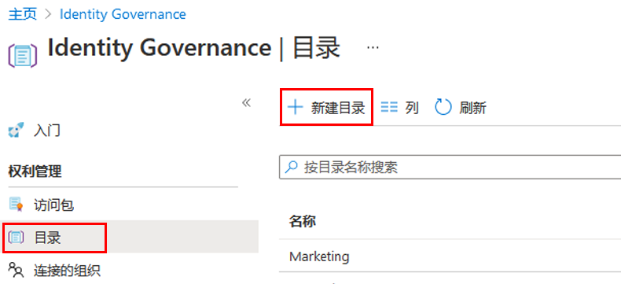
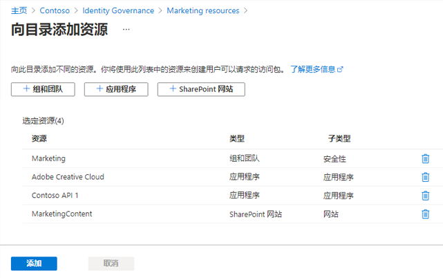
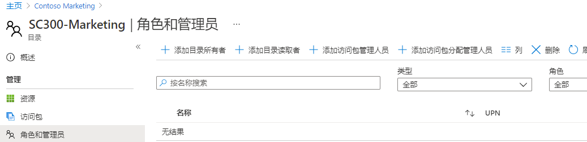
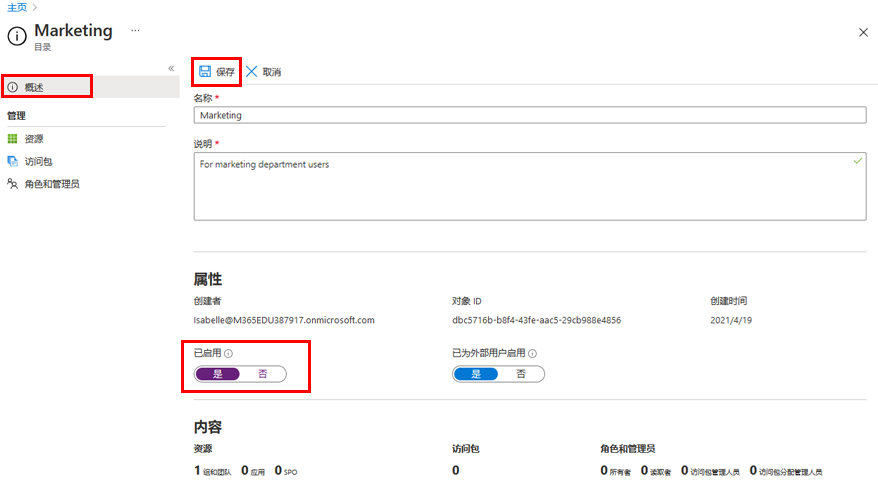

---
lab:
    title: '25 - 在 Azure AD 权利管理中创建和管理资源目录'
    learning path: '04'
    module: '模块 01 - 计划和实现权利管理'
---

# 实验室 25：在 Azure AD 权利管理中创建和管理资源目录

## 实验室场景

目录是资源和访问包的容器。当你希望将相关资源和访问包进行分组时，需要创建目录。创建目录的人员成为首个目录所有者。这位目录所有者可以添加其他目录所有者。你需要在组织中创建并配置目录。

#### 预计用时：15 分钟

## 创建目录

1. 使用全局管理员帐户登录到 [https://portal.azure.com](https://portal.azure.com)。

    >重要说明
    >若要使用和配置 Azure AD 使用条款，必须具备以下先决条件：
    >
    >- Azure AD Premium P1、P2、EMS E3 或 EMS E5 订阅。
    >- 如果你没有这些订阅，可获取 Azure AD Premium 订阅或启用 Azure AD Premium 试用版订阅。
    >- 下述适用于需配置的目录的管理员帐户之一：
    >    - 全局管理员
    >    - 安全管理员
    >    - 条件访问管理员

1. 打开 **Azure Active Directory**，然后选择“**Identity Governance**”。

1. 在左侧菜单的“**权利管理**”下，选择“**目录**”。

1. 在顶部菜单中选择“**+ 新建策略**”。

    

1. 在“新建目录”窗格的“**名称**”框中，输入“**市场营销**”。

1. 在“**说明**”框中，输入“**面向市场营销部门用户**”。用户将在访问包的详细信息中看到此信息。

1. “**为外部用户启用**”选项使所选外部目录中的用户可以在此目录中请求访问包。不会对此设置进行任何更改。

1. 在“**启用”下，选择“否**”。

1. 可选择启用目录以立即使用，如果打算暂存该目录，则在打算使用之前，可选择将其禁用或使其不可用。对于本练习，无需启用目录。

    

1. 选择“创建”。

## 将资源添加到目录

若要将资源包含在访问包中，该资源必须位于目录中。可添加的资源类型包括组、应用程序和 SharePoint Online 站点。其中的组可以是云创建的 Microsoft 365 组或云创建的 Azure AD 安全组。应用程序可以是 Azure AD 企业应用程序，包括 SaaS 应用程序和你自己的联合到 Azure AD 的应用程序。站点可以是 SharePoint Online 站点或 SharePoint Online 网站集。

1. 如有必要，在“标识治理”边栏选项卡中选择“**目录**”。

2. 在“**目录**”列表中，选择“**市场营销**”。

3. 在左侧导航栏的“**管理**”下，选择“**资源**”。

4. 在菜单上，选择 + “**添加资源**”。

5. 在“向目录添加资源”边栏选项卡中查看可用选项。  添加以下项：

| 资源类型 | 值 |
| :------------- | :---------- |
|  **组和 Teams** | 零售 |
|  **应用程序** | 框 |
|  **应用程序** | Salesforce |
|  **SharePoint 网站** | 品牌 SharePoint <<< 从可用 SharePoint 网站列表中选择 |

6. 你可能在组和 Teams、应用程序或 SharePoint 网站中没有任何资源。选择任何资源类别，然后从该类别中选择一个资源。

7. 对于本练习，可选择任何可用的资源。

    

8. 完成后，单击“**添加**”。这些资源现在可包含在目录中的访问包内。

## 添加其他目录所有者

创建目录的用户成为首个目录所有者。若要委托目录管理，可为用户添加目录所有者角色。这有助于共担目录管理责任。

1. 如有必要，在 Azure 门户中浏览到“**Azure Active Directory**” > “**Identity Governance**”>“**目录**”，然后选择“**市场营销**”。

2. 在“营销目录”边栏选项卡的左侧导航菜单中，选择“角色和管理员”。

    

3. 在顶部菜单中，查看可用的角色，然后选择“**+ 添加目录所有者**”。

4. 在“选择成员”窗格中，选择“**Adele Vance**”，然后选择“**选择**”。

5. 查看“角色和管理员”列表中新添加的角色。

## 编辑目录

可以编辑目录的名称和说明。用户可在访问包的详细信息中看到此信息。

1. 在“市场营销”边栏选项卡的左侧导航栏中，选择“**概述**”。

2. 在顶部菜单中，选择“**编辑**”。

3. 查看设置，然后在“**属性**” > “**启用**”下选择“**是**”。

    

4. 选择“**保存**”。

## 删除目录

可以删除目录，但只有在其没有任何访问包时才可删除。

1. 在“市场营销”目录的“概述”页的顶部菜单中，选择“删除”。

2. 在“删除”对话框中，查看信息，然后选择“**否**”。

    **备注** - 我们将保留目录以供下一个实验室使用。
