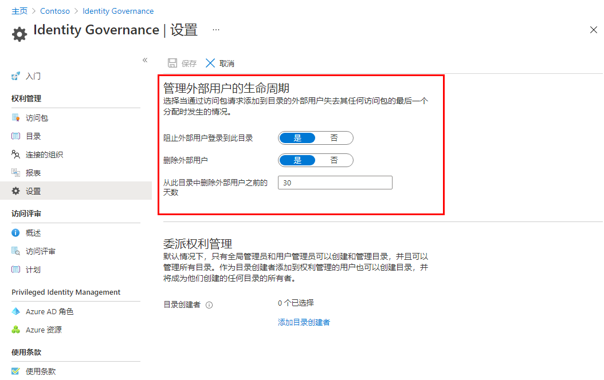

---
lab:
    title: '27 - 使用 Azure AD Identity Governance 设置来管理外部用户的生命周期'
    learning path: '04'
    module: '模块 01 - 计划和实现权利管理'
---

# 实验室 27：使用 Azure AD Identity Governance 设置来管理外部用户的生命周期  

## 实验室场景

你可以选择当一位受邀通过已批准的访问包请求访问目录的外部用户不再具有任何访问包分配时发生的情况。如果该用户放弃所有访问包分配，或者最后一个访问包分配过期，则可能会发生此情况。默认情况下，当外部用户不再具有任何访问包分配时，他们无法登录到你的目录。30 天后，系统会从你的目录中删除他们的来宾用户帐户。

#### 预计用时：5 分钟

## 使用 Azure AD Identity Governance 设置来管理外部用户的生命周期

1. 以全局管理员身份登录到 [https://portal.azure.com](https://portal.azure.com)。

1. 具有全局管理员或用户管理员角色的帐户才能完成这些任务。

1. 打开 Azure Active Directory，然后选择“**Identity Governance**”。

1. 在左侧导航菜单的“**权利管理**”下，选择“**设置**”。

1. 在顶部菜单中，选择“**编辑**”。

    

1. 在“**管理外部用户的生命周期**”部分中，查看外部用户的其他设置。

1. 当外部用户失去其对任何访问包的最后一个分配时，如果想要阻止其登录到此目录，请将“**阻止外部用户登录到此目录**”设置为“**是**”。

1. 如果阻止用户登录到目录，则用户将无法在此目录中重新请求访问包或请求其他访问权限。如果用户以后需要请求访问其他访问包，请勿配置为阻止其登录。

1. 当外部用户失去其对任何访问包的最后一个分配时，如果想要删除其在此目录中的来宾用户帐户，请将“**删除外部用户**”设置为“**是**”。

    > **备注** - 使用“权利管理”，仅可删除通过“权利管理”邀请的帐户。另请注意，即使已将用户添加到目录中的资源，但该目录不是访问包分配，也将阻止用户登录该目录，并将其从该目录中删除。如果来宾在收到访问包分配时已位于目录中，则其将继续位于该目录中。但是，如果通过访问包分配邀请来宾，并且来宾在受邀后还被分配到 OneDrive for Business 或 SharePoint Online 站点，则仍将删除该来宾。

1. 如果你想要在此目录中删除来宾用户帐户，可以设置删除前要经过的天数。如果你想要在来宾失去其对任何访问包的最后一个分配时立即删除其用户帐户，请将“**从此目录中删除外部用户前要经过的天数**”设置为“**0**”。

1. 如果进行了任何更改，请选择“**保存**”。
