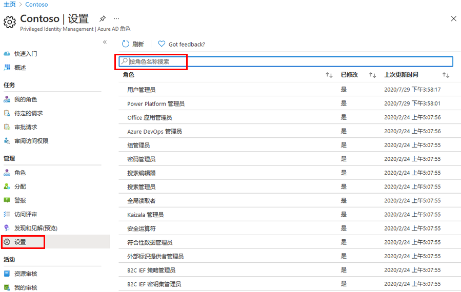
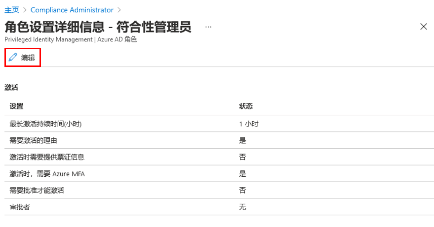
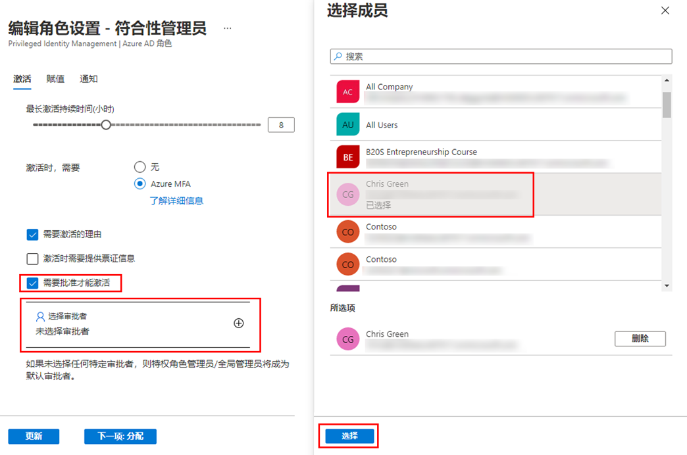

---
lab:
    title: '28 - 针对 Azure AD 角色配置 Privileged Identity Management'
    learning path: '04'
    module: '模块 03 - 计划和实现权利管理'
---

# 实验室 28：针对 Azure AD 角色配置 Privileged Identity Management

## 实验室场景

特权角色管理员可以自定义其 Azure Active Directory (Azure AD) 组织中的 Privileged Identity Management (PIM)，包括更改激活符合条件的角色分配的用户的体验。你需要熟悉如何配置 PIM。

#### 预计用时：15 分钟

## 配置 Azure AD 角色设置

### 打开角色设置

遵循以下步骤打开 Azure AD 角色的设置。

1. 以全局管理员身份登录到 [https://portal.azure.com](https://portal.azure.com)。

1. 搜索并选择 **“Azure AD Privileged Identity Management”**。

1. 在 “Privileged Identity Management” 边栏选项卡的左侧导航窗格中，选择 **“Azure AD 角色”**。

1. 在“快速启动”页的左侧导航窗格中，选择 **“设置”**。

    

1. 查看角色列表，然后在 **“按角色名称搜索”** 中输入 **“合规性”**。

1. 在结果中，选择 **“合规性管理员”**。

1. 查看角色设置详细信息。

### 需要批准才能激活

如果设置多名批准者，只要其中一名批准者批准或拒绝，该批准即告完成。不能要求获得至少两位用户的批准。若要需要批准才能激活角色，请执行以下步骤。

1. 在“角色设置详细信息”页的顶部菜单中，选择 **“编辑”**。

    

1. 在“编辑角色设置 - 合规性管理员”边栏选项卡中，选中 **“需要批准才能激活”** 复选框。

1. 选择 **“选择审批者”**。

1. 在“选择成员”窗格中，选择你的管理员帐户，然后选择 **“选择”**。

    

1. 配置角色设置后，选择 **“更新”** 以保存更改。
