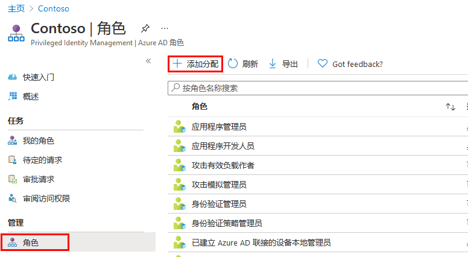
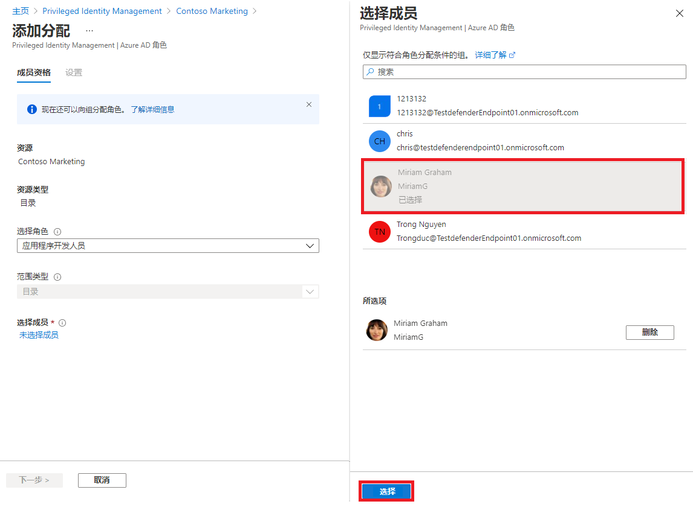
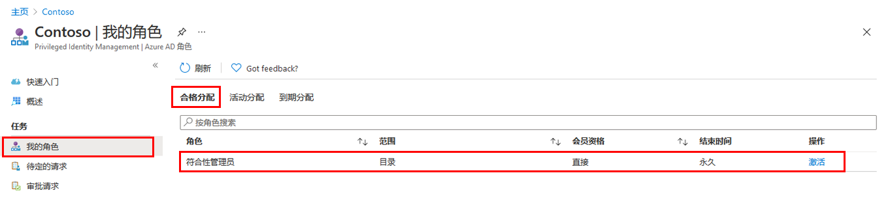
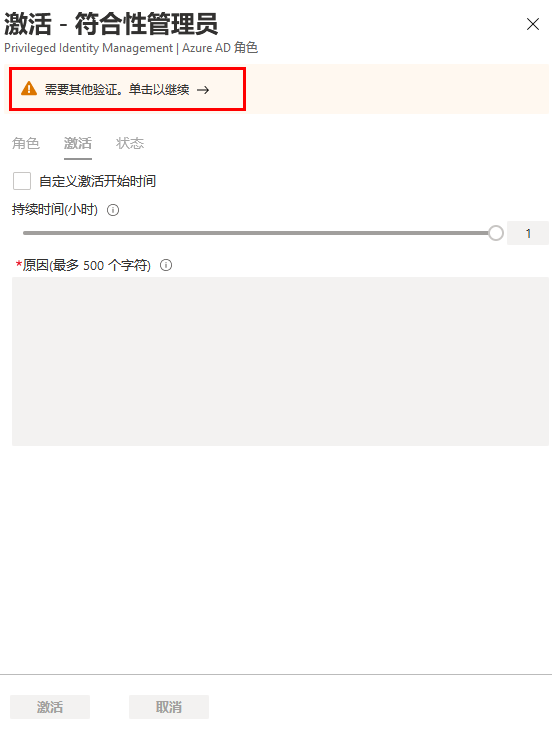
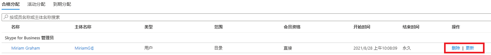

---
lab:
    title: '29 - 针对 Azure AD 角色配置 Privileged Identity Management'
    learning path: '04'
    module: '模块 03 - 计划和实现特权访问'
---

# 实验室 29：在 Privileged Identity Management 中分配 Azure AD 角色

## 实验室场景

使用 Azure Active Directory (Azure AD)，全局管理员可以进行永久性 Azure AD 管理员角色分配。可以使用 Azure 门户或 PowerShell 命令创建这些角色分配。

Azure AD Privileged Identity Management (PIM) 服务还允许特权角色管理员进行永久管理员角色分配。此外，特权角色管理员可使用户符合 Azure AD 管理员角色的条件。符合条件的管理员可在需要时激活角色，在完成任务后，其权限随即失效。

#### 预计用时：15 分钟

## 分配角色

按照以下步骤操作，使用户符合 Azure AD 管理员角色的条件。

1. 使用全局管理员帐户登录到 [https://portal.azure.com](https://portal.azure.com)。

1. 搜索并选择“**Azure AD Privileged Identity Management**”。

1. 在“Privileged Identity Management”边栏选项卡的左侧导航窗格中，选择“A**zure AD 角色**”。

1. 在“快速启动”页的左侧导航窗格中，选择“**角色**”。

1. 在顶部菜单中，选择“**+ 添加分配**”。

    

1. 在“添加分配”边栏选项卡的“**成员身份**”选项卡上，查看设置。

1. 选择“**选择角色**”菜单，然后选择“**合规性管理员**”。

1. 可以使用“**按名称搜索角色**”筛选器来帮助查找角色。

1. 在“**选择成员**”下，选择“**未选择任何成员**”。

1. 在“选择成员”窗格中，选择“**Miriam Graham**”，然后选择“**选择**”。

    

1. 在“添加分配”边栏选项卡中，选择“**下一步**”。

1. 在“**设置**”选项卡的“**分配类型**”下，查看可用选项。对于此任务，请使用默认设置。

    - “符合条件”的分配要求该角色的成员执行某个操作才能使用该角色。操作可能包括执行多重身份验证 (MFA) 检查、提供业务理由或请求获得指定审批者的批准。
    - “活动”分配不要求该角色的成员执行任何操作便可使用该角色。分配为“活动”的成员拥有始终分配给该角色的特权。

1. 查看其余设置，然后选择“**分配**”。

## 以 Miriam 身份登录

1. 打开一个新的 InPrivate 浏览器窗口。
2. 连接到 Azure 门户 (https://portal.azure.com)。
3. 如果门户在用户登录后打开，请单击右上角的用户名称，然后选择“**以其他帐户登录**”。
4. 以 Miriam 身份登录。

| 字段 | 值 |
| :--- | :--- |
| 用户名 | **MiriamG@** `<<your domain.onmicrosoft.com>>` |
| 密码 | pass@word123 |

5. 关闭“**欢迎使用 Azure**”对话框。
6. 从“**搜索资源、服务和文档**”栏中查找 Azure Active Directory，然后打开边栏选项卡。
7. 在“**概述**”页上，查找“**我的源**”。
8. 选择 Miriam Graham 的名字下的“**查看个人资料**”；该操作会打开 Miriam 的个人资料页面。
9. 选择“**分配的角色**”，然后选择“**符合条件的分配**”。
10. 请注意，Miriam 现在可以使用“**合规性管理员**”角色。

## 激活 Azure AD 角色

当你需要承担 Azure AD 角色时，可以通过在 Privileged Identity Management 中打开“**我的角色**”来请求激活。

1. 从“**搜索资源、服务和文档**”栏中，查找“特权”。
2. 打开“**Azure AD Privileged Identity Management**”边栏选项卡。
3. 在“Privileged Identity Management”边栏选项卡的左侧导航菜单中，选择“**我的角色**”。

1. 在“我的角色”边栏选项卡中，查看符合条件的分配的列表。

    

1. 在“合规性管理员角色”行中，选择“**激活**”。

1. 在“激活 - 合规性管理员”窗格中，选择“**需要其他验证**”，然后按照说明提供其他安全验证。在每个会话中只需执行身份验证一次。

    

    **验证** - 根据当前实验室环境配置，需要配置 MFA 并成功登录。

1. 完成附加安全验证后，在“激活 - 合规性管理员”窗格的“**原因**”框中，输入“**这是我激活此角色的理由**”。

    **重要说明** - 最小权限原则，帐户激活的时长应该为所需的时长。  如果需要完成的工作只需要 1.5 小时，那么将持续时间设置为 2 小时。  同样，如果你知道自己在下午 3 点前无法完成工作，请选择“自定义”激活时间。

1. 选择“**激活**”。

## 分配范围受限的角色

对于某些角色，所授予权限的范围可以限制为单个管理单元、服务帐户或应用程序。此过程是分配具有管理单元范围的角色的一个示例。

1. 请记得关闭 MiriamG 的浏览器窗口，然后以管理员帐户身份打开 Azure 门户。
2. 浏览到“Privileged Identity Management”边栏选项卡，在左侧导航菜单中，选择“**Azure AD 角色**”。
3. 选择“**角色**”。
4. 在“角色”边栏选项卡的顶部菜单中，选择“**+ 添加分配**”。

5. 在“添加分配”边栏选项卡中，选择“**选择角色**”菜单，然后选择“**用户管理员**”。

1. 选择“**范围类型**”菜单，并查看可用选项。现在，你需要使用“**目录**”范围类型。

>[!提示]
>转到 [https://docs.microsoft.com/zh-cn/azure/active-directory/roles/admin-units-manage](https://docs.microsoft.com/zh-cn/azure/active-directory/roles/admin-units-manage)，了解有关管理单元范围类型的详细信息。

1. 与在不具有限制的范围内分配角色一样，你需要添加成员并完成设置选项。现在选择“**取消**”。

## 更新或删除现有的角色分配

按照以下步骤更新或删除现有的角色分配。

1. 在“打开 Azure AD Privileged Identity Management”>“Azure AD 角色”边栏选项卡中，在左侧导航窗格中选择“**分配**”。

1. 在“**分配**”列表中，对于合规性管理员，查看“**操作**”列中的选项。

    

1. 选择“**更新**”并查看“成员身份设置”窗格中的可用选项。完成后，关闭窗格。

1. 选择“**删除**”。

1. 在“**删除**”对话框中，查看信息，然后选择“**是**”。
